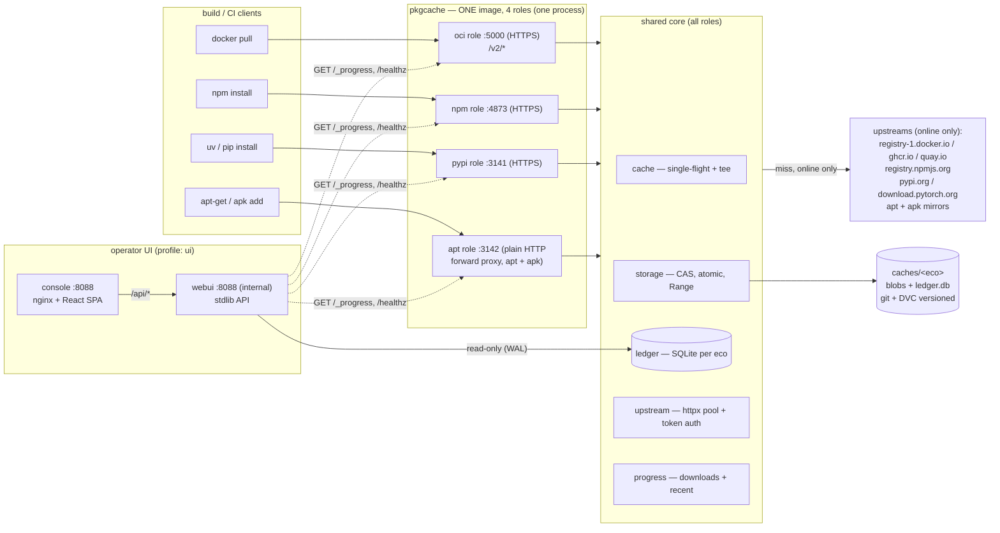
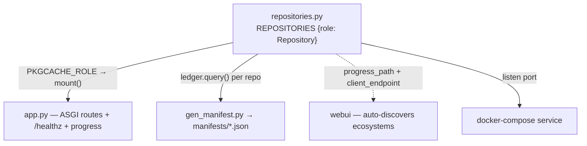
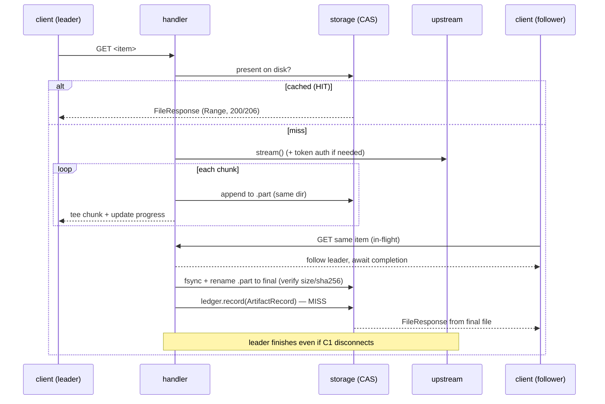
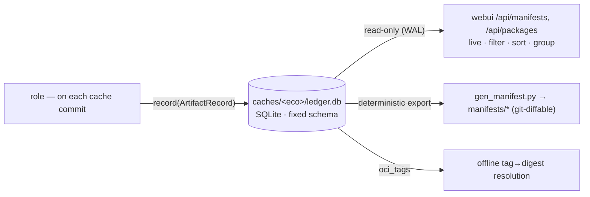
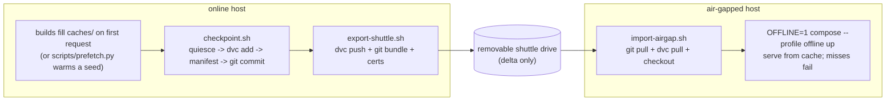
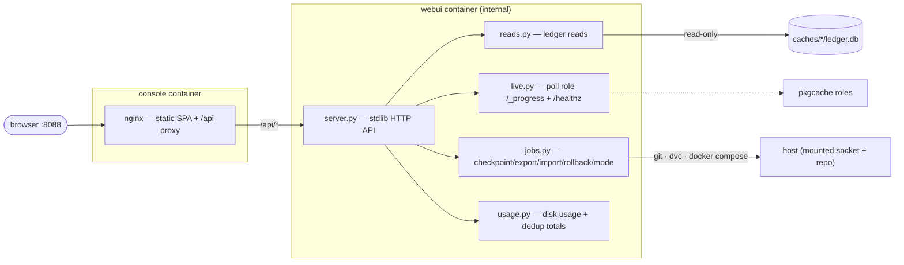

# package-registry — a versioned, air-gap-portable package cache

A single host runs **one Python service** that pull-through-caches four package
ecosystems at once — **container images (OCI/Docker), npm, PyPI (pip/uv), and
apt + apk** — for build/CI machines on a trusted network. Everything fetched once
is stored under `caches/`, versioned with **git + DVC**, and shuttled across an
air gap as **deltas only**, with a per-ecosystem **SQLite ledger** recording
exactly what each checkpoint contains.

An operator **console** (React + TypeScript) sits on top: browse cache contents,
watch live downloads, monitor disk, and drive checkpoint / export / import /
rollback and online↔offline switching — all over a dependency-free stdlib API.

---

## What this is (and what changed)

The proxies used to be **four different upstream projects**, each vendored and
built into its own image:

| Ecosystem | Old component | Language | Now |
|---|---|---|---|
| OCI / Docker | **zot** | Go | `pkgcache` `oci` handler |
| npm | **Verdaccio** | Node | `pkgcache` `npm` handler |
| PyPI / pip | **devpi** | Python | `pkgcache` `pypi` handler |
| apt + apk | **apt-cacher-ng** | C++ | `pkgcache` `apt` handler |

Those four protocols' **read / pull-through paths have been ported into one
dependency-light Python codebase** (`pkgcache/`). This intentionally reverses the
project's former "never reimplement a package protocol" stance. The drivers:

- **Drop the Go/Node/C++ polyglot build** — one slim Python image instead of four.
- **One native download-progress implementation** instead of three bolted-on
  patches (devpi never had one — the old UI polled a `/+progress` endpoint that
  didn't exist).
- **Full ownership of the on-disk layout** — a clean content-addressed store and a
  native SQLite ledger written *as packages are cached*, instead of
  reverse-engineering and re-walking each upstream's private cache format.
- **Smaller, air-gap-friendly images.**

Only the **pull/read** path is reimplemented — there is no publish/push.

> The git history still shows the old layout (`zot/`, `verdaccio/`, `pip/devpi`,
> `apt-cacher-ng/`, `config/`); those are the retired upstreams kept for reference.
> The live system is `pkgcache/` + `webui/`.

---

## System architecture



TLS for the three HTTPS roles is **terminated in-process** from `./certs` (minted
by `gen-certs.sh`) — there is no separate TLS proxy. apt/apk is a plain-HTTP
forward proxy, so it is never TLS.

---

## Repository layout

```
package-registry/
├── docker-compose.yml         # pkgcache (4 roles) + webui + console; online/offline/ui profiles
├── pkgcache/                  # THE cache service (one image, four roles)
│   ├── Dockerfile  pyproject.toml  pkgcache.yaml  seed.example.yaml  usage.md
│   └── src/pkgcache/
│       ├── app.py             # builds the ASGI app for the role(s); mounts /healthz + progress
│       ├── __main__.py        # uvicorn entrypoint
│       ├── repositories.py    # registry {role: Repository} — the one place ecosystems are listed
│       ├── core/
│       │   ├── repository.py  # the unified Repository contract + ArtifactRecord
│       │   ├── cache.py       # pull-through facade: hit→serve, miss→single-flight stream
│       │   ├── storage.py     # CAS + path-safe layout + atomic temp→fsync→rename + Range serving
│       │   ├── inflight.py    # single-flight leader/follower; tees upstream→disk→client
│       │   ├── upstream.py    # shared httpx pool + anonymous Bearer-token dance
│       │   ├── progress.py    # in-proc progress: in-flight downloads + recent feed (HIT/MISS/FAIL)
│       │   ├── ledger.py      # per-eco SQLite: record() at commit, query()/export() for UI/manifest
│       │   └── config.py      # role + upstream/index maps from env + one YAML
│       └── handlers/          # one Repository implementation per ecosystem
│           ├── oci.py         # /v2/* — replaces zot
│           ├── npm.py         # packument + tarball — replaces Verdaccio
│           ├── pypi.py        # PEP 503/691 simple index + files — replaces devpi
│           ├── apt.py         # forward proxy, volatile/immutable revalidation — replaces apt-cacher-ng
│           └── common.py      # shared name/filename normalization
├── webui/                     # operator control UI
│   ├── server.py              # thin stdlib HTTP router (the API)
│   ├── config.py reads.py live.py jobs.py usage.py   # the API split into focused modules
│   ├── index.html             # legacy single-file UI (fallback; superseded by console)
│   └── console/               # the React + TypeScript SPA (Vite) + nginx Dockerfile
├── scripts/                   # the glue we own
│   ├── checkpoint.sh          # quiesce → snapshot (DVC) → manifest export → git commit
│   ├── export-shuttle.sh      # dvc push + git bundle + certs → removable drive (online side)
│   ├── import-airgap.sh       # git pull + dvc pull + checkout + certs (air-gapped side)
│   ├── gen-certs.sh           # mint the private CA + server cert for in-process HTTPS
│   ├── gen_manifest.py        # export manifests/<eco>.json from the ledgers (+ --rebuild repair)
│   └── prefetch.py            # warm the cache from a declarative seed file
├── caches/                    # proxy data — DVC-tracked, git-ignored (blobs + ledger.db per eco)
└── manifests/                 # derived, git-diffable export of the ledgers
```

---

## Components & design choices

### 1. One image, four roles

`pkgcache` is a single installable package built into one image. Each compose
service runs that image in a different **role** (`oci | npm | pypi | apt`) selected
by `PKGCACHE_ROLE`; in the default mode (env unset) one container runs **all four
roles in one process**, each bound to its own port. The protocols can't share a
port — OCI owns `/v2/` at the root and apt is a forward proxy — so the ports are
fixed: **5000 / 4873 / 3141 (HTTPS), 3142 (HTTP)**.

> **Why:** the cache is identical across ecosystems; only the *protocol wrapper*
> differs. One image is the whole polyglot-build reduction the rewrite was for.

### 2. The unified `Repository` contract

Every ecosystem implements one contract ([core/repository.py](pkgcache/src/pkgcache/core/repository.py)); the
rest of the system (role wiring, manifest export, the webui, checkpoint) depends
only on it, never on a specific ecosystem.



Adding a 5th ecosystem (crates, Go modules, Maven, …) is: add `handlers/<eco>.py`,
register it, add one compose service. Manifest, checkpoint, DVC versioning and the
UI pick it up with no other changes.

### 3. Shared core primitives

Built once, reused by every handler:

- **`storage.py`** — a **content-addressed blob store** (`blobs/sha256/<aa>/<hex>`)
  plus a **path-safe** layout for index files. Every write is an *atomic
  temp-in-same-dir → fsync → rename*, so DVC and the checkpoint quiesce never see a
  partial file. Files are world-readable (`0644`/`0755`). Serving goes through
  Starlette `FileResponse`, so **HTTP Range (206 / resume / parallel download) is
  handled for free** on every cached file. Orphan `.part` files are GC'd on startup.
- **`inflight.py`** — a **single-flight** registry keyed per content item. The first
  requester is the *leader* (streams upstream → temp file, **tees** chunks to the
  client, and keeps downloading to completion even if that client disconnects, so
  the cache still warms); concurrent requesters are *followers* that await the
  leader's completion and serve the finished file. One upstream fetch per item, ever.
- **`upstream.py`** — one pooled `httpx.AsyncClient`; bodies are always **streamed**
  (`aiter_bytes`), never buffered, so multi-GB wheels/layers are safe. A generic
  anonymous **Bearer-token dance** (parse `WWW-Authenticate`, fetch + cache the
  token by scope) handles registries that require it.
- **`progress.py`** — the **single** native progress implementation that replaces
  the three old upstream patches. A counting wrapper updates per-download records
  `{id, name, downloaded, total, pct, status}`; a ring buffer records recent pulls
  `{id, name, size, hit, failed, time}`. One JSON shape across all roles.
- **`cache.py`** — the façade handlers call: hit → `FileResponse`; miss →
  single-flight stream with progressive delivery; records the artifact in the ledger
  on commit; records a **FAIL** in the feed if the fetch errors.

#### The one pull-through path (OCI blobs, PyPI files, npm tarballs, apt files)



### 4. The protocol handlers (ported from the old components)

Each handler is a `Repository` reusing the core primitives. Endpoint shapes,
header semantics, and quirks are ported from the component it replaces.

- **`oci.py` — replaces zot.** Serves `/v2/`, `/v2/<name>/manifests/<ref>`,
  `/v2/<name>/blobs/<digest>`, `/v2/<name>/tags/list`. **Multi-upstream**: the first
  path segment is the destination (`dockerhub → registry-1.docker.io`,
  `ghcr → ghcr.io`, `quay → quay.io`), with Docker Hub's `library/` rule applied.
  Manifests and blobs are content-addressed in **one CAS**; a **tag→digest index**
  (`oci_tags` table) lets the offline side resolve tags with no upstream — collapsing
  zot's two-service online/offline split into one service + an `OFFLINE` flag. As it
  serves, it records each cached **image** in the ledger with a real, **deduplicated**
  size (shared layers counted once) for both tag and by-digest pulls.

  ```mermaid
  flowchart TD
    req["GET /v2/&lt;dest&gt;/&lt;repo&gt;/manifests/&lt;ref&gt;"] --> isDigest{ref is a digest?}
    isDigest -->|yes| cas["serve manifest bytes from CAS by digest"]
    isDigest -->|tag| off{OFFLINE?}
    off -->|online| reval["fetch tag upstream (token dance)\n-> digest; update oci_tags + ledger"]
    off -->|offline| lookup["oci_tags: (upstream,repo,tag) -> digest"]
    reval --> cas
    lookup --> cas
    cas --> client["bytes + Docker-Content-Digest\n(client walks index -> child -> config + layers, all by digest)"]
  ```

- **`pypi.py` — replaces devpi, and fixes its defect.** Serves the PEP 503 / 691
  simple index (`/<index>/+simple/<project>/`), rewriting file URLs back at this
  proxy and **preserving the attributes uv/pip depend on** — per-file hashes,
  `requires-python`, `yanked`, and the PEP 658/714 `core-metadata` marker
  (normalized to the bool-or-`{algo: hash}` map the JSON API requires, so `uv`
  accepts HTML-sourced indexes). `<index>` selects the upstream
  (`root/pypi → pypi.org`, `root/pytorch-cu124 → download.pytorch.org/whl/cu124`, …).
  Files stream through the single-flight core with **full Range support** — fixing
  devpi's defect of re-downloading multi-GB torch wheels on every install.

- **`npm.py` — replaces Verdaccio.** Fetches the packument, **rewrites every
  `dist.tarball`** to point at this proxy, caches the rewritten doc (so offline still
  serves it), and streams/verifies tarballs through the core.

- **`apt.py` — replaces apt-cacher-ng.** A **forward proxy** (apt sets
  `Acquire::http::Proxy`, apk sets `http_proxy`). **Volatile** index files
  (`InRelease`, `Packages*`, `APKINDEX.tar.gz`, …) are revalidated online via stored
  `ETag`/`Last-Modified`; **immutable** files (`*.deb`, `*.apk`, `pool/*`) are served
  from cache without upstream contact. Stays plain HTTP on `:3142`.

### 5. The cache ledger (per-ecosystem SQLite)

The manifest is no longer a checkpoint-time JSON re-derived by walking each
proxy's cache. Each role maintains a **SQLite ledger** at `caches/<eco>/ledger.db`
written *natively as it caches* (one writer per file, WAL mode). The webui queries
it read-only; the git-committed `manifests/*` is a **derived, deterministic export**.



**Why SQLite:** it's stdlib (the webui stays dependency-free), a single
DVC-trackable file that ships across the gap and rolls back with `dvc checkout`,
and supports real queries for the UI. Rich, volatile fields (`cached_at`, `origin`,
`path`, `arch`, `extra`) live only in the DB; the git export keeps just
`{ecosystem, name, version, digest, size}`, sorted, so diffs stay clean. A
`--rebuild` repair path can repopulate a ledger from disk if it ever drifts.

### 6. Versioning & air-gap transfer (git + DVC)

The cache is the **data**; git + DVC are the **checkpoint / delta / rollback**
engine. Blobs are content-addressed DVC objects; the small DVC pointers, the
manifest, and the ledger are versioned in git.



- **Checkpoint** = a `git checkout`-able snapshot: quiesce the roles so a blob is
  never captured without its ledger row, `dvc add` the caches, export the manifest,
  `git commit`.
- **Transfer** moves only objects the destination lacks (`dvc push`/`pull`); the CA
  cert/key ride the shuttle, not git.
- **Rollback** = `git checkout <commit> && dvc checkout`.
- **Offline is an env flag** (`OFFLINE=1`), not a separate service — every role then
  serves from cache only and a miss simply fails (the air-gap contract).

### 7. The operator UI: stdlib API + React console

Two services in the `ui` profile:



- **webui** ([webui/server.py](webui/server.py)) — a **standard-library-only** HTTP API (no framework,
  no `pip install`; the whole point is to run on a fully air-gapped host). Split into
  focused modules: `reads` (live cache contents from the ledgers, with disk-usage and
  deduplicated-docker totals), `live` (polls each role's `/_progress` + `/healthz` to
  build the downloads feed and a real **N proxies up** / online-offline signal),
  `jobs` (a one-at-a-time runner that shells out to the scripts for
  checkpoint/export/import/rollback and an online↔offline **mode switch**), and
  `usage` (a cached `du`-style scan). It is now **internal only** — reached as
  `webui:8088` on the compose network.
- **console** ([webui/console/](webui/console/)) — a full **React + TypeScript (Vite)** SPA with **no
  runtime dependencies**, built to static assets and served by a small **nginx**
  container that reverse-proxies `/api` to webui. It is the public entry on `:8088`.
  Dense single page: packages by ecosystem (each group scrolls on its own), live
  downloads, a **HIT / MISS / FAIL** feed, a **storage monitor** (cache share vs other
  vs free, with low-space warnings), maintenance actions with a **streaming job
  console**, git history + rollback, and copy-paste pull endpoints. OKLCH dark/light
  theming, IBM Plex Mono throughout. nginx defers DNS to request time, so the SPA
  still loads (and `/api` returns 502) even if webui is down.

> **No auth, binds all interfaces** — run only on a trusted network. The webui runs
> real `git`/`dvc`/`docker compose` commands against the host (mounted socket + repo).

### 8. Scripts (the glue we own)

`checkpoint.sh` · `export-shuttle.sh` · `import-airgap.sh` · `gen-certs.sh` ·
`gen_manifest.py` (ledger → manifest export, `--rebuild` repair) · `prefetch.py`
(warm the cache from a declarative seed file by driving real client pulls through
the local proxies, so the ledger populates exactly as a real client would).

---

## Quick start

**Online host:**

```bash
git init && dvc init
./scripts/gen-certs.sh                                 # mint the CA + in-process TLS cert
docker compose --profile online up -d                  # bring up the cache (4 roles)
docker compose --profile online --profile ui up -d     # + the operator console on :8088
# install certs/ca.crt on each build host so HTTPS is trusted
```

Point build tools at the roles, then version and ship:

```bash
# ... builds run; the cache fills on first request ...
./scripts/checkpoint.sh "added numpy 2.1 + torch 2.3"  # version it
./scripts/export-shuttle.sh /media/shuttle             # stage the delta
```

**Air-gapped host** (carry the drive across):

```bash
./scripts/import-airgap.sh /media/shuttle              # apply the delta
OFFLINE=1 docker compose --profile offline --profile ui up -d
```

### Pull endpoints

| Ecosystem | Client points at |
|---|---|
| Docker / OCI | `<host>:5000/{dockerhub,ghcr,quay}/<image>` (HTTPS) |
| npm | `https://<host>:4873/` |
| pip / uv | `https://<host>:3141/root/pypi/+simple/` (and `root/pytorch-*` indexes) |
| apt / apk | HTTP forward proxy at `http://<host>:3142/` |
| Console UI | `http://<host>:8088` |

---

## Notable behaviors

- **Single worker per role.** Progress and single-flight state are in-process; each
  role runs one uvicorn worker (don't replicate a role).
- **No garbage collection, by design.** Caches grow unbounded; size is managed by
  DVC/checkpoint hygiene, not eviction. The console's storage monitor surfaces it.
- **Anonymous pulls only.** Public images/packages via the generic token dance; no
  upstream credentials. Docker Hub's anonymous pull cap applies to cold bursts.
- **Open forward proxy (apt).** No mirror allowlist — acceptable only on the
  isolated networks this stack targets (same posture as the no-auth UI).
- **One-way serving cutover.** The Python stack can't serve **pre-rewrite**
  checkpoints (old on-disk formats); roll back only to post-rewrite commits, or
  re-warm.
- **Integrity on commit.** Content hashes are verified before the atomic rename;
  non-2xx responses are never cached as content.

---

## Status

A working rewrite, exercised end-to-end through each ecosystem. Pin image digests
before production. The retired upstream projects remain in the tree (untracked) for
reference and for serving any pre-rewrite checkpoints.
