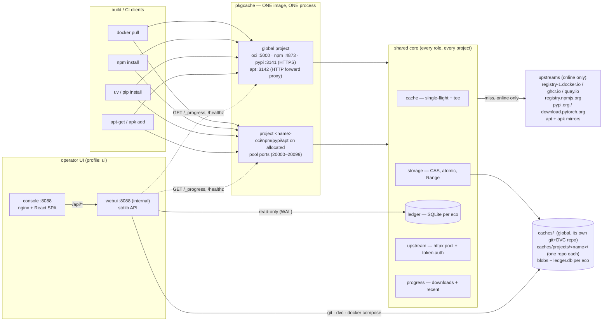
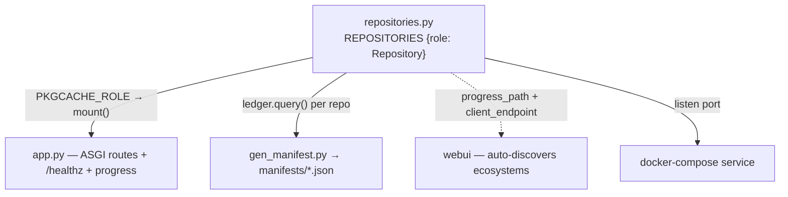
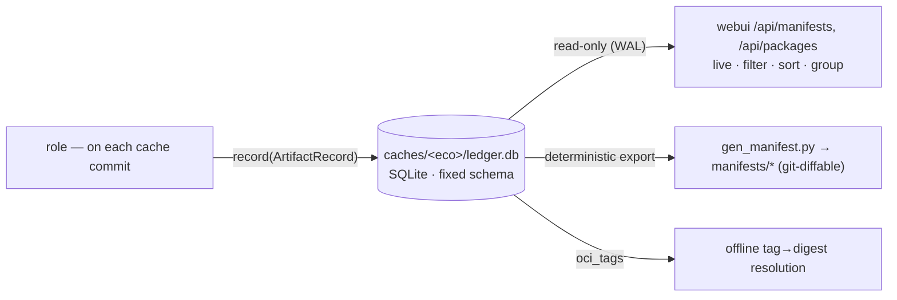
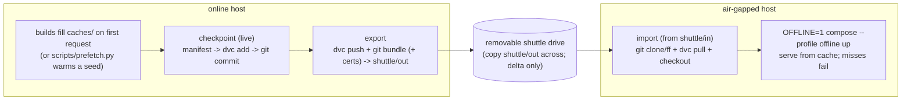
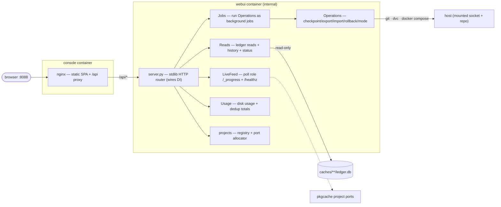

# package-registry — a versioned, air-gap-portable package cache

A single host runs **one Python service** that pull-through-caches four package
ecosystems at once — **container images (OCI/Docker), npm, PyPI (pip/uv), and
apt + apk** — for build/CI machines on a trusted network. Everything fetched once
is stored under `caches/`, versioned in its **own git + DVC repo**, and shuttled
across an air gap as **deltas only**, with a per-ecosystem **SQLite ledger**
recording exactly what each checkpoint contains.

The same instance can serve **one or many isolated projects** — each with its own
URLs (a port per ecosystem), its own cache tree, and its own git + DVC repo — from
a single always-on process, with no container-per-project sprawl.

An operator **console** (React + TypeScript) sits on top: browse cache contents,
watch live downloads, monitor disk, switch projects, and drive checkpoint / export
/ import / rollback and online↔offline switching — all over a dependency-free
standard-library API.

---

## TL;DR

**Run it** (online host — fills the cache on demand; add `--profile ui` for the console on `:8088`):

```bash
cp .env.example .env && ./scripts/gen-certs.sh         # one-time: host ids + TLS CA
docker compose --profile online --profile ui up -d     # one process, 4 roles + console
```

Air-gapped host: `OFFLINE=1 docker compose --profile offline --profile ui up -d` (serves from cache only).

**Pull from it** — `HOST` = cache host; trust `certs/ca.crt` on the client for the HTTPS roles (docker/pip/uv/npm). apt/apk need no CA.

```bash
# docker  (dockerhub | ghcr | quay; official images are under library/)
docker pull HOST:5000/dockerhub/library/python:3.12-slim

# pip     (root/pypi, or root/pytorch-cu124 etc. for PyTorch wheels)
pip install --index-url https://HOST:3141/root/pypi/+simple/ --cert ca.crt numpy

# uv
UV_INDEX_URL=https://HOST:3141/root/pypi/+simple/ SSL_CERT_FILE=ca.crt uv pip install numpy

# npm
npm install --registry https://HOST:4873/ --cafile ca.crt left-pad

# apt     (forward proxy — keep http mirror lines)
echo 'Acquire::http::Proxy "http://HOST:3142";' | sudo tee /etc/apt/apt.conf.d/01proxy

# apk     (Alpine — reads http_proxy; switch repos to http)
http_proxy=http://HOST:3142 apk add --no-cache curl
```

For a **named project**, swap the global port for that project's allocated port
(`20000…`, shown in the console). Full client recipes:
[Pulling from the cache](#pulling-from-the-cache-per-ecosystem). Versioning + air-gap
transfer: [How to use it](#how-to-use-it).

---

## How to use it

The whole lifecycle is five steps. (Full walkthrough, per-project usage, and TLS
trust are in [Quick start](#quick-start) below.)

**1 — Bring it up on the online host.**

```bash
git init                                            # the code repo (the cache repo self-inits later)
cp .env.example .env                                # set PKGCACHE_UID/GID + DOCKER_GID to your host's ids
./scripts/gen-certs.sh                              # mint the private CA + in-process TLS cert
docker compose --profile online --profile ui up -d  # cache (one process, 4 roles) + console on :8088
```

**2 — Point your build/CI tools at it** (install `certs/ca.crt` so HTTPS is trusted
— see [Trusting the TLS cert](#trusting-the-caches-tls-certificate-fixes-x509-certificate-signed-by-unknown-authority)):

| Tool | Point it at |
|---|---|
| docker | `<host>:5000/{dockerhub,ghcr,quay}/<image>` |
| pip / uv | `--index-url https://<host>:3141/root/pypi/+simple/` |
| npm | `--registry https://<host>:4873/` |
| apt / apk | HTTP proxy `http://<host>:3142/` |

The cache fills automatically on the first request for each package, and the
console at **http://&lt;host&gt;:8088** shows it live (downloads, hit/miss feed, disk).

**3 — Version what you've cached** (live — the proxies keep serving):

```bash
python3 scripts/pkgops.py checkpoint "added numpy 2.1 + torch 2.3"
```

**4 — Ship it across the air gap.** Export stages a delta into `shuttle/out/`; copy
that onto removable media, carry it over, drop it into `shuttle/in/` on the far
side, and import:

```bash
# online host:
python3 scripts/pkgops.py export                    # → shuttle/out/  (then copy onto your media)
# air-gapped host (files copied into shuttle/in/):
python3 scripts/pkgops.py import                    # ← shuttle/in/
OFFLINE=1 docker compose --profile offline --profile ui up -d
```

**5 — Serve offline.** With `OFFLINE=1` every role serves from cache only; a miss
simply fails. Point the air-gapped build hosts at the same URLs.

> Prefer the UI? The console drives checkpoint / export / import / rollback and the
> online↔offline switch with a streaming job log — and creates/switches projects.
> Everything the CLI does, it does too.

---

## What this is (and what changed)

The proxies used to be **four different upstream projects**, each vendored and
built into its own image:

| Ecosystem | Old component | Language | Now |
|---|---|---|---|
| OCI / Docker | **zot** | Go | `pkgcache` `oci` handler |
| npm | **Verdaccio** | Node | `pkgcache` `npm` handler |
| PyPI / pip | **devpi** | Python | `pkgcache` `pypi` handler |
| apt + apk | **apt-cacher-ng** | C++ | `pkgcache` `apt` handler |

Those four protocols' **read / pull-through paths have been ported into one
dependency-light Python codebase** (`pkgcache/`). This intentionally reverses the
project's former "never reimplement a package protocol" stance. The drivers:

- **Drop the Go/Node/C++ polyglot build** — one slim Python image instead of four.
- **One native download-progress implementation** instead of three bolted-on
  patches (devpi never had one — the old UI polled a `/+progress` endpoint that
  didn't exist).
- **Full ownership of the on-disk layout** — a clean content-addressed store and a
  native SQLite ledger written *as packages are cached*, instead of
  reverse-engineering and re-walking each upstream's private cache format.
- **Smaller, air-gap-friendly images.**

Only the **pull/read** path is reimplemented — there is no publish/push.

Layered on top of that rewrite, the more recent changes are:

- **Cache state split into its own git + DVC repo.** The versioned cache
  (`caches/.git` + `caches/.dvc`) is now **separate from this code repo**, so a
  checkpoint, rollback or shuttle only ever touches cache state — never the
  application code — and the two histories never entangle.
- **Air-gap operations are Python, not bash.** `checkpoint / export / import /
  rollback / mode` live in one backend module (`webui/ops.py`) as a service that
  yields log lines; the control UI calls it in-process and the operator CLI
  (`scripts/pkgops.py`) is a thin wrapper over the *same* code, so the two can
  never drift.
- **Multi-project support.** One process serves a default **global** project plus
  any number of named projects, each on its own allocated port-set, cache tree and
  repo — created, switched and deleted live from the console (see
  [docs/multi-project.md](docs/multi-project.md)).
- **Live, no-downtime checkpoints.** Atomic writes let DVC hash the cache while the
  proxies keep serving — no quiesce, no stop/start.
- **A two-page React console** (Overview + Packages) with a project switcher.
- **Fixed shuttle staging dirs** (`shuttle/out`, `shuttle/in`) instead of passing a
  drive path — the operator copies `out/` onto media and drops it into `in/` on the
  far side.

> The git history still shows the old layout (`zot/`, `verdaccio/`, `pip/devpi`,
> `apt-cacher-ng/`, retired upstream configs under `config/`); those are the retired
> components kept for reference. The live system is `pkgcache/` + `webui/`.

---

## System architecture



TLS for the three HTTPS roles is **terminated in-process** from `./certs` (minted
by `gen-certs.sh`) — there is no separate TLS proxy. apt/apk is a plain-HTTP
forward proxy, so it is never TLS. Every project reuses the same server cert (ports
don't affect the cert's SANs).

---

## Multi-project on one instance

One central process serves a reserved **global** project on the default ports
*plus* any number of named projects, each fully isolated. Full design notes:
[docs/multi-project.md](docs/multi-project.md).

| Aspect | Global project | Named project |
|---|---|---|
| URLs | fixed `5000 / 4873 / 3141 / 3142` | one port per role from the pool (default `20000–20099`) |
| Cache tree | `caches/<eco>/` | `caches/projects/<name>/<eco>/` |
| Version control | `caches/.git` + `.dvc` | `caches/projects/<name>/.git` + `.dvc` (its own repo) |
| Shuttle | `shuttle/{out,in}/` | `shuttle/{out,in}/projects/<name>/` |
| Registry entry | implicit (never stored/allocated) | `config/projects.json` |

- **One process, always.** The instance binds more sockets per project; it never
  forks a process or container per project. The compose file publishes the whole
  pool range up front, so creating a project needs **no container recreate** — a
  supervisor in `pkgcache/__main__.py` polls the registry and binds/unbinds a
  project's ports live.
- **Stable URLs.** Ports are allocated **once at create time** (lowest free in the
  pool, OS-probed), persisted to `config/projects.json`, and never recomputed on
  boot. Deleting a project frees its ports back to the pool.
- **Isolation by construction.** Separate cache trees and separate repos mean a
  per-project checkpoint / rollback / shuttle only ever touches that one project.
  There is no cross-project dedup (a deliberate tradeoff for isolation).
- **The registry is shared, JSON, and host-specific.** Both the webui (writer) and
  pkgcache (reader) point at the same `PKGCACHE_PROJECTS` file; it's gitignored
  because it's per-host state.

```json
// config/projects.json
{
  "pool": {"start": 20000, "end": 20099},
  "projects": {
    "projA": {"oci": 20000, "npm": 20001, "pypi": 20002, "apt": 20003}
  }
}
```

Projects are created / selected / deleted from the console's top-bar switcher (or
`POST/DELETE /api/projects`); every CLI op takes `--project <name>` (default
`global`). A named project's shuttle carries a `project.json` so an import on the
air-gapped side re-registers it and binds its URLs automatically.

---

## Repository layout

```
package-registry/
├── docker-compose.yml         # pkgcache (one process) + webui + console; online/offline/ui profiles
├── .env.example               # host UID/GID + docker gid + shuttle dir → copy to .env (gitignored)
├── pkgcache/                  # THE cache service (one image, four roles, multi-project)
│   ├── Dockerfile  pyproject.toml  pkgcache.yaml  seed.example.yaml  usage.md
│   └── src/pkgcache/
│       ├── app.py             # builds the ASGI app for a (project, role); mounts /healthz + progress
│       ├── __main__.py        # uvicorn entrypoint + supervisor that binds projects live
│       ├── repositories.py    # registry {role: Repository} — the one place ecosystems are listed
│       ├── core/
│       │   ├── repository.py  # the unified Repository contract + ArtifactRecord
│       │   ├── cache.py       # pull-through facade: hit→serve, miss→single-flight stream
│       │   ├── storage.py     # CAS + path-safe layout + atomic temp→fsync→rename + Range serving
│       │   ├── inflight.py    # single-flight leader/follower; tees upstream→disk→client
│       │   ├── upstream.py    # shared httpx pool + anonymous Bearer-token dance
│       │   ├── progress.py    # in-proc progress: in-flight downloads + recent feed (HIT/MISS/FAIL)
│       │   ├── ledger.py      # per-eco SQLite: record() at commit, query()/export() for UI/manifest
│       │   └── config.py      # per-(project, role) config from env + one YAML + the registry
│       └── handlers/          # one Repository implementation per ecosystem
│           ├── oci.py         # /v2/* — replaces zot
│           ├── npm.py         # packument + tarball — replaces Verdaccio
│           ├── pypi.py        # PEP 503/691 simple index + files — replaces devpi
│           ├── apt.py         # forward proxy, volatile/immutable revalidation — replaces apt-cacher-ng
│           └── common.py      # shared name/filename normalization
├── webui/                     # operator control plane (standard-library only)
│   ├── server.py              # thin stdlib HTTP router; wires the collaborators below (DI)
│   ├── config.py              # shared constants + per-project URL / progress / health derivation
│   ├── reads.py               # Reads  — ledger reads, manifest, git history, proxy status
│   ├── live.py                # LiveFeed — background poller; downloads + recent + health snapshots
│   ├── jobs.py                # Jobs   — one-at-a-time background job runner over Operations
│   ├── ops.py                 # Operations — checkpoint/export/import/rollback/mode (yields log lines)
│   ├── usage.py               # Usage  — TTL-cached cache-disk scan + dedup totals
│   ├── projects.py            # the project registry + port allocator (single source of truth)
│   ├── test_projects.py       # unit tests: allocator (next-free, reserved, persistence, exhaustion)
│   ├── test_multiproject.py   # integration tests: scoped reads / ops / endpoints / shuttle paths
│   ├── index.html             # legacy single-file UI (fallback; superseded by console)
│   └── console/               # the React + TypeScript SPA (Vite) + nginx Dockerfile
├── scripts/                   # the glue we own
│   ├── pkgops.py              # thin CLI over webui/ops.py (the UI imports the SAME code in-process)
│   ├── gen-certs.sh           # mint the private CA + server cert for in-process HTTPS
│   ├── gen_manifest.py        # export manifests/<eco>.json from the ledgers (+ --rebuild repair)
│   └── prefetch.py            # warm the cache from a declarative seed file
├── config/                    # config/projects.json (the registry) + retired upstream configs
├── caches/                    # cache data — its OWN git+DVC repo (blobs + ledger.db per eco);
│   └── projects/<name>/       #   one git+DVC repo per named project
├── shuttle/                   # fixed air-gap staging: out/ (export) and in/ (import)
├── certs/                     # private CA + server cert/key (gen-certs.sh; gitignored)
└── docs/                      # multi-project.md, docker-builds.md
```

---

## Components & design choices

### 1. One image, one process, four roles, many projects

`pkgcache` is a single installable package built into one image. In the default
mode (env unset) **one container runs all four roles in one process**, each bound
to its own port; a supervisor reads the project registry and binds each named
project's port-set live. (A single role can still be run alone via `PKGCACHE_ROLE`
for dev.) The protocols can't share a port — OCI owns `/v2/` at the root and apt is
a forward proxy — so the global ports are fixed: **5000 / 4873 / 3141 (HTTPS), 3142
(HTTP)**; project ports come from the pool.

> **Why:** the cache is identical across ecosystems and projects; only the
> *protocol wrapper* and the *cache root* differ. One image + one process is the
> whole polyglot-build reduction the rewrite was for.

### 2. The unified `Repository` contract

Every ecosystem implements one contract ([core/repository.py](pkgcache/src/pkgcache/core/repository.py)); the
rest of the system (role wiring, manifest export, the webui, checkpoint) depends
only on it, never on a specific ecosystem.



Adding a 5th ecosystem (crates, Go modules, Maven, …) is: add `handlers/<eco>.py`,
register it, add one compose service. Manifest, checkpoint, DVC versioning and the
UI pick it up with no other changes.

### 3. Shared core primitives

Built once, reused by every handler:

- **`storage.py`** — a **content-addressed blob store** (`blobs/sha256/<aa>/<hex>`)
  plus a **path-safe** layout for index files. Every write is an *atomic
  temp-in-same-dir → fsync → rename*, so a checkpoint can hash the cache **live**
  (no proxy quiesce) and DVC never sees a partial file. In-flight `.part` files are
  skipped via `.dvcignore`. Files are world-readable (`0644`/`0755`). Serving goes through
  Starlette `FileResponse`, so **HTTP Range (206 / resume / parallel download) is
  handled for free** on every cached file. Orphan `.part` files are GC'd on startup.
- **`inflight.py`** — a **single-flight** registry keyed per content item. The first
  requester is the *leader* (streams upstream → temp file, **tees** chunks to the
  client, and keeps downloading to completion even if that client disconnects, so
  the cache still warms); concurrent requesters are *followers* that tail-follow the
  growing file and converge on the finished one. One upstream fetch per item, ever.
- **`upstream.py`** — one pooled `httpx.AsyncClient`; bodies are always **streamed**
  (`aiter_bytes`), never buffered, so multi-GB wheels/layers are safe. A generic
  anonymous **Bearer-token dance** (parse `WWW-Authenticate`, fetch + cache the
  token by scope) handles registries that require it.
- **`progress.py`** — the **single** native progress implementation that replaces
  the three old upstream patches. A counting wrapper updates per-download records
  `{id, name, downloaded, total, pct, status}`; a ring buffer records recent pulls
  `{id, name, size, hit, failed, time}`. One JSON shape across all roles.
- **`cache.py`** — the façade handlers call: hit → `FileResponse`; miss →
  single-flight stream with progressive delivery; verifies size/sha256 and records
  the artifact in the ledger on commit; records a **FAIL** in the feed if the fetch
  errors.

#### The one pull-through path (OCI blobs, PyPI files, npm tarballs, apt files)


### 4. The protocol handlers (ported from the old components)

Each handler is a `Repository` reusing the core primitives. Endpoint shapes,
header semantics, and quirks are ported from the component it replaces.

- **`oci.py` — replaces zot.** Serves `/v2/`, `/v2/<name>/manifests/<ref>`,
  `/v2/<name>/blobs/<digest>`, `/v2/<name>/tags/list`. **Multi-upstream**: the first
  path segment is the destination (`dockerhub → registry-1.docker.io`,
  `ghcr → ghcr.io`, `quay → quay.io`), with Docker Hub's `library/` rule applied.
  Manifests and blobs are content-addressed in **one CAS**; a **tag→digest index**
  (`oci_tags` table) lets the offline side resolve tags with no upstream — collapsing
  zot's two-service online/offline split into one service + an `OFFLINE` flag. As it
  serves, it records each cached **image** in the ledger with a real, **deduplicated**
  size (shared layers counted once) for both tag and by-digest pulls.

  ```mermaid
  flowchart TD
    req["GET /v2/&lt;dest&gt;/&lt;repo&gt;/manifests/&lt;ref&gt;"] --> isDigest{ref is a digest?}
    isDigest -->|yes| cas["serve manifest bytes from CAS by digest"]
    isDigest -->|tag| off{OFFLINE?}
    off -->|online| reval["fetch tag upstream (token dance)\n-> digest; update oci_tags + ledger"]
    off -->|offline| lookup["oci_tags: (upstream,repo,tag) -> digest"]
    reval --> cas
    lookup --> cas
    cas --> client["bytes + Docker-Content-Digest\n(client walks index -> child -> config + layers, all by digest)"]
  ```

- **`pypi.py` — replaces devpi, and fixes its defect.** Serves the PEP 503 / 691
  simple index (`/<index>/+simple/<project>/`), rewriting file URLs back at this
  proxy and **preserving the attributes uv/pip depend on** — per-file hashes,
  `requires-python`, `yanked`, and the PEP 658/714 `core-metadata` marker
  (normalized to the bool-or-`{algo: hash}` map the JSON API requires, so `uv`
  accepts HTML-sourced indexes). `<index>` selects the upstream
  (`root/pypi → pypi.org`, `root/pytorch-cu124 → download.pytorch.org/whl/cu124`, …).
  Files stream through the single-flight core with **full Range support** — fixing
  devpi's defect of re-downloading multi-GB torch wheels on every install.

- **`npm.py` — replaces Verdaccio.** Fetches the packument, **rewrites every
  `dist.tarball`** to point at this proxy, caches the rewritten doc (so offline still
  serves it), and streams/verifies tarballs through the core.

- **`apt.py` — replaces apt-cacher-ng.** A **forward proxy** (apt sets
  `Acquire::http::Proxy`, apk sets `http_proxy`). **Volatile** index files
  (`InRelease`, `Packages*`, `APKINDEX.tar.gz`, …) are revalidated online via stored
  `ETag`/`Last-Modified`; **immutable** files (`*.deb`, `*.apk`, `pool/*`) are served
  from cache without upstream contact. Stays plain HTTP on `:3142`.

### 5. The cache ledger (per-ecosystem SQLite)

The manifest is no longer a checkpoint-time JSON re-derived by walking each
proxy's cache. Each role maintains a **SQLite ledger** at `caches/<eco>/ledger.db`
(or `caches/projects/<name>/<eco>/ledger.db`) written *natively as it caches* (one
writer per file, WAL mode). The webui queries it read-only; the git-committed
`manifests/*` is a **derived, deterministic export**.



**Why SQLite:** it's stdlib (the webui stays dependency-free), a single
DVC-trackable file that ships across the gap and rolls back with `dvc checkout`,
and supports real queries for the UI. Rich, volatile fields (`cached_at`, `origin`,
`path`, `arch`, `extra`) live only in the DB; the git export keeps just
`{ecosystem, name, version, digest, size}`, sorted, so diffs stay clean. A
`--rebuild` repair path can repopulate a ledger from disk if it ever drifts.

> Because the webui is deliberately stdlib-only it can't import `pkgcache`, so it
> re-reads the ledger files directly ([webui/reads.py](webui/reads.py)) instead of
> calling `Ledger.query`. The two query implementations carry cross-reference notes
> to keep the sort whitelist + column set in sync.

### 6. Versioning & air-gap transfer (git + DVC)

The cache is the **data**; git + DVC are the **checkpoint / delta / rollback**
engine. Blobs are content-addressed DVC objects; the small DVC pointers, the
manifest, and the ledger are versioned in git. **Each project's cache state lives
in its own repo, separate from this code repo**, so cache history and code history
never entangle and a rollback can't touch the application.



- **Checkpoint** = a `git checkout`-able snapshot, taken **live** (the proxies keep
  serving): regenerate the manifest, `dvc add` the caches, `git commit` in the
  project's cache repo. Atomic temp→rename writes mean DVC never captures a partial
  blob, so no quiesce/downtime; in-flight `.part` downloads are skipped and land in
  the next checkpoint. (The cache repo's git + DVC store self-initialize on the
  first checkpoint.)
- **Export** stages into the **fixed** `shuttle/out/` (a named project nests under
  `shuttle/out/projects/<name>/`): a `dvc push` of the objects (all of them for a
  full export, or just the `--base..--target` delta), a self-contained `git bundle`,
  and a `checkpoints.json` listing what's inside. The global export also carries the
  TLS material (`ca.crt` + server cert/key — **never** the CA private key); a named
  export carries `project.json` so import can register the project. **The operator
  copies everything in `shuttle/out/` onto removable media** — the tool never takes a
  drive path.
- **Import** reads the **fixed** `shuttle/in/` (where the operator dropped the files
  off their media): clone/fast-forward the bundle, `dvc pull` + `dvc checkout` the
  objects, install certs (global), and re-register a named project from its
  `project.json`. It tolerates the common ways a manual copy mangles the DVC
  `dvcstore/files/md5` layout and normalizes it before pulling.
- **Rollback** = `git checkout <commit> && dvc checkout` inside the project's repo.
- **Offline is an env flag** (`OFFLINE=1`), not a separate service — every role then
  serves from cache only and a miss simply fails (the air-gap contract).

### 7. The operator control plane: stdlib API + React console

Two services in the `ui` profile:



- **webui** ([webui/server.py](webui/server.py)) — a **standard-library-only** HTTP API (no framework,
  no `pip install`; the whole point is to run on a fully air-gapped host). Each
  responsibility is a small **owner class**, wired once by the router via constructor
  injection:
  - **`Reads`** ([reads.py](webui/reads.py)) — live cache contents from the ledgers, the committed
    manifest, the cache-repo git history, and proxy container status.
  - **`LiveFeed`** ([live.py](webui/live.py)) — a background poller (bounded thread pool, project
    list refreshed each cycle) that hits every project's `/_progress` + `/healthz`
    and owns the merged downloads / recent / health snapshots, plus the real **N
    proxies up** / online-offline signal.
  - **`Jobs`** ([jobs.py](webui/jobs.py)) — a one-at-a-time background runner that drains an
    `Operations` generator into a streamed log the UI polls.
  - **`Operations`** ([ops.py](webui/ops.py)) — the air-gap **service**:
    checkpoint/export/import/rollback and the online↔offline **mode switch**, each a
    generator of log lines, scoped by `project`.
  - **`Usage`** ([usage.py](webui/usage.py)) — a TTL-cached `du`-style scan with deduplicated-docker
    totals.
  - **`projects`** ([projects.py](webui/projects.py)) — the registry + port allocator: the single source
    of truth for what projects exist and where they live.

  webui is **internal only** — reached as `webui:8088` on the compose network.
- **console** ([webui/console/](webui/console/)) — a full **React + TypeScript (Vite)** SPA with **no
  runtime dependencies**, built to static assets and served by a small **nginx**
  container that reverse-proxies `/api` to webui (the public entry on `:8088`). It is
  a **two-page** app behind a top bar with a **project switcher** (select / create /
  delete; selection persisted in `localStorage`):
  - **Overview** — a health-strip of KPIs (packages, cache size, hit rate, active
    downloads, uncommitted-since-checkpoint, proxies up), a live **downloads** panel,
    a **HIT / MISS / FAIL** recent feed, a maintenance **Actions** panel with a
    streaming job console, **git history + rollback**, a **storage monitor** (cache
    share vs other vs free, with low-space warnings), and copy-paste pull endpoints.
  - **Packages** — a full-height browse of cached artifacts by ecosystem (each group
    scrolls on its own; server-side filter / sort / paginate).

  OKLCH dark/light theming, IBM Plex Mono throughout. nginx defers DNS to request
  time, so the SPA still loads (and `/api` returns 502) even if webui is down.

> **No auth, binds all interfaces** — run only on a trusted network. The webui runs
> real `git`/`dvc`/`docker compose` commands against the host (mounted socket + repo).

### 8. Scripts (the glue we own)

- **`pkgops.py`** — a thin CLI over the backend `Operations` service: `checkpoint ·
  export · import · rollback · mode`, plus `--project`. It imports `webui/ops.py` and
  runs the **exact same code** the control UI runs in-process, so the CLI and the UI
  can never drift. Use it by hand on either side of the gap.
- **`gen-certs.sh`** — mint the private CA + server cert for in-process HTTPS.
- **`gen_manifest.py`** — export the ledgers to `manifests/<eco>.json`
  (`PKGCACHE_MANIFEST_ROOT` points it at a project's repo); `--rebuild` repairs a
  ledger from disk.
- **`prefetch.py`** — warm the cache from a declarative seed file by driving real
  client pulls through the local proxies, so the ledger populates exactly as a real
  client would.

---

## Quick start

**Online host:**

```bash
git init                                               # the CODE repo (cache repo self-inits on first checkpoint)
cp .env.example .env                                   # set PKGCACHE_UID/GID + DOCKER_GID to your host's ids
./scripts/gen-certs.sh                                 # mint the CA + in-process TLS cert
docker compose --profile online up -d                  # bring up the cache (one process, four roles)
docker compose --profile online --profile ui up -d     # + the operator console on :8088
# install certs/ca.crt on each build host so HTTPS is trusted (see below)
```

Point build tools at the roles, then version and ship:

```bash
# ... builds run; the cache fills on first request ...
python3 scripts/pkgops.py checkpoint "added numpy 2.1 + torch 2.3"   # version it (live, no downtime)
python3 scripts/pkgops.py export                                     # stage into shuttle/out (full)
# or just the diff between two checkpoints:
python3 scripts/pkgops.py export --base <sha> --target <sha>
# then COPY everything under ./shuttle/out onto your removable media.
```

**Air-gapped host** (carry the drive across, drop the files into `shuttle/in/`):

```bash
python3 scripts/pkgops.py import                       # apply from shuttle/in
OFFLINE=1 docker compose --profile offline --profile ui up -d
```

**Per project**, add `--project <name>` to any op (create the project first from the
console's switcher, or `POST /api/projects`):

```bash
python3 scripts/pkgops.py --project projA checkpoint "added torch"
python3 scripts/pkgops.py --project projA export        # → shuttle/out/projects/projA/
```

### Pull endpoints (global project)

| Ecosystem | Client points at |
|---|---|
| Docker / OCI | `<host>:5000/{dockerhub,ghcr,quay}/<image>` (HTTPS) |
| npm | `https://<host>:4873/` |
| pip / uv | `https://<host>:3141/root/pypi/+simple/` (and `root/pytorch-*` indexes) |
| apt / apk | HTTP forward proxy at `http://<host>:3142/` |
| Console UI | `http://<host>:8088` |

A named project serves the same shapes on its own allocated ports (shown in the
console's Endpoints panel) — swap the port and use the rest of each recipe below
verbatim.

### Pulling from the cache (per ecosystem)

`HOST` = the cache host (name or IP). The three HTTPS roles use the private CA, so
each client must trust `certs/ca.crt` first (see
[Trusting the TLS cert](#trusting-the-caches-tls-certificate-fixes-x509-certificate-signed-by-unknown-authority));
apt/apk need nothing — they use the plain-HTTP proxy. For a **named project**,
replace the global port with that project's allocated port (`20000…` etc., from the
console's Endpoints panel).

#### Docker / OCI — port 5000 (HTTPS)

The first path segment picks the upstream: `dockerhub` → Docker Hub, `ghcr` →
ghcr.io, `quay` → quay.io. Official Docker Hub images live under `library/`.

```bash
# official Docker Hub images are under library/:
docker pull HOST:5000/dockerhub/library/alpine:3.20
docker pull HOST:5000/dockerhub/library/python:3.12-slim
# user/org images keep their namespace:
docker pull HOST:5000/dockerhub/grafana/grafana:11.0.0
# other registries:
docker pull HOST:5000/ghcr/astral-sh/uv:python3.12-bookworm-slim
docker pull HOST:5000/quay/prometheus/prometheus:v2.53.0
```

In a Dockerfile, parameterize the registry so images come through the cache:

```dockerfile
ARG REGISTRY=HOST:5000/dockerhub
FROM ${REGISTRY}/library/python:3.12-slim
```

> Docker trusts a registry CA **per `host:port`** — add `certs/ca.crt` under
> `/etc/docker/certs.d/HOST:5000/` (and under each project's OCI port you pull from).

#### pip / uv — port 3141 (HTTPS)

`<index>` selects the upstream: `root/pypi` → PyPI, `root/pytorch-cu124` →
PyTorch CUDA 12.4 wheels, `root/pytorch-cpu` → CPU wheels, etc.

```bash
# pip (one-off):
pip install --index-url https://HOST:3141/root/pypi/+simple/ --cert ca.crt numpy
# PyTorch CUDA wheels (off PyPI):
pip install --index-url https://HOST:3141/root/pytorch-cu124/+simple/ --cert ca.crt torch
# uv:
UV_INDEX_URL=https://HOST:3141/root/pypi/+simple/ SSL_CERT_FILE=ca.crt uv pip install numpy
```

Persist it in `~/.config/pip/pip.conf` (`PIP_CERT` covers the cert):

```ini
[global]
index-url = https://HOST:3141/root/pypi/+simple/
cert = /path/to/ca.crt
```

#### npm — port 4873 (HTTPS)

```bash
npm install --registry https://HOST:4873/ --cafile ca.crt <pkg>
# or persist it:
npm config set registry https://HOST:4873/
npm config set cafile /path/to/ca.crt        # or: export NODE_EXTRA_CA_CERTS=/path/to/ca.crt
```

#### apt (Debian/Ubuntu) — port 3142 (HTTP forward proxy)

apt is a forward proxy: tell apt to use it and keep **http** mirror lines (it does
not tunnel HTTPS). No CA needed.

```bash
# on a host:
echo 'Acquire::http::Proxy "http://HOST:3142";' | sudo tee /etc/apt/apt.conf.d/01proxy
sudo apt-get update && sudo apt-get install -y curl
```

```dockerfile
# in an image:
RUN echo 'Acquire::http::Proxy "http://HOST:3142";' > /etc/apt/apt.conf.d/01proxy \
 && apt-get update && apt-get install -y curl
```

#### apk (Alpine) — port 3142 (HTTP forward proxy)

apk reads `http_proxy`; switch the repositories to http first. No CA needed.

```dockerfile
RUN sed -i 's/https/http/' /etc/apk/repositories \
 && http_proxy=http://HOST:3142 apk add --no-cache ca-certificates curl
```

> **Online vs offline is transparent to clients.** The recipes are identical on both
> sides of the gap — online fills the cache on first request; with `OFFLINE=1` the
> same URLs serve from cache and a miss simply fails.

### Trusting the cache's TLS certificate (fixes `x509: certificate signed by unknown authority`)

The HTTPS roles terminate TLS in-process with a **private CA** minted by
`gen-certs.sh`. A client that hasn't been told to trust `certs/ca.crt` rejects the
connection, e.g.:

```
Error response from daemon: failed to resolve reference
"172.17.21.107:20000/dockerhub/pgvector/pgvector:pg17": ... tls: failed to verify
certificate: x509: certificate signed by unknown authority
```

Copy `certs/ca.crt` to the build host, then trust it. **Docker trusts a registry
CA per `host:port`**, so you need one entry for each OCI port you pull from — the
global port (`5000`) *and* every project's allocated OCI port (`20000`, `20010`, …
from the registry pool):

```bash
# Docker — per registry host:port (no daemon restart needed):
sudo mkdir -p /etc/docker/certs.d/172.17.21.107:20000
sudo cp ca.crt /etc/docker/certs.d/172.17.21.107:20000/ca.crt
#   repeat for :5000 and any other project OCI ports you pull from.
```

For everything else, install the CA into the **system trust store** (covers the
Docker daemon too, after a daemon restart; and apt/apk):

```bash
sudo cp ca.crt /usr/local/share/ca-certificates/package-cache.crt   # Debian/Ubuntu
sudo update-ca-certificates
sudo systemctl restart docker        # daemon re-reads system roots on restart
#   RHEL/Alpine: /etc/pki/ca-trust/source/anchors/ + update-ca-trust
```

pip and npm don't use the system store — point them at the CA directly:

```bash
export PIP_CERT=/path/to/ca.crt
npm config set cafile /path/to/ca.crt          # or: export NODE_EXTRA_CA_CERTS=/path/to/ca.crt
```

**Skip verification per host (`--trusted-host`, no CA needed).** If you can't
distribute the CA, you can tell the client to trust the cache host without
verifying its certificate — the TLS-level equivalent of Docker's
`insecure-registries`. For pip (use the *same* `host:port` you pull from, including
a project's port):

```bash
pip install --index-url https://172.17.21.107:20000/root/pypi/+simple/ \
            --trusted-host 172.17.21.107:20000  <pkg>
```

Or make it permanent in `pip.conf` (`~/.config/pip/pip.conf`, or `pip.ini` on
Windows):

```ini
[global]
index-url = https://172.17.21.107:20000/root/pypi/+simple/
trusted-host = 172.17.21.107:20000
```

The npm equivalent is `npm config set strict-ssl false` (global, not per-host —
prefer `cafile` above). For Docker, the equivalent is `insecure-registries` (see
the last bullet below). These skip verification, so prefer trusting the CA on
networks where you can.

Two related gotchas:

- **Name/IP must be in the cert.** A cert is only valid for names in its SANs. If
  you reach the cache by an IP or hostname that wasn't covered when the cert was
  minted, re-run `./scripts/gen-certs.sh <that-ip-or-host>` (the CA is reused, so
  existing trust stays valid) and restart the cache.
- **Last resort (not recommended):** add the `host:port` to Docker's
  `insecure-registries` in `/etc/docker/daemon.json` to skip verification entirely.
  Prefer trusting the CA — it keeps TLS verification on.

---

## Testing

The control plane ships with tests that don't need docker/dvc:

```bash
cd webui && python3 -m unittest test_projects test_multiproject -v
```

- **`test_projects.py`** — the port allocator: lowest-free + contiguous allocation,
  reserved (global) ports never handed out, freed ports reused, persistence across
  reload, name validation, pool exhaustion.
- **`test_multiproject.py`** — the scoped control plane: per-project endpoint /
  progress / health derivation, per-project ledger reads, per-project git history
  (must not leak the code repo's history), per-project shuttle paths, the `build`
  dispatcher's project validation, and the DVC `md5/`-tree normalization an import
  performs.

---

## Notable behaviors

- **Single worker per role.** Progress and single-flight state are in-process; each
  role runs one uvicorn worker (don't replicate a role).
- **One process, many ports.** Projects are added/removed live by a registry-polling
  supervisor; the pool range is published once in compose, so no container recreate.
- **No cross-project dedup.** Each project has its own tree and repo — isolation over
  sharing. (A shared DVC remote could be layered later without changing topology.)
- **No garbage collection, by design.** Caches grow unbounded; size is managed by
  DVC/checkpoint hygiene, not eviction. The console's storage monitor surfaces it.
- **Anonymous pulls only.** Public images/packages via the generic token dance; no
  upstream credentials. Docker Hub's anonymous pull cap applies to cold bursts.
- **Open forward proxy (apt).** No mirror allowlist — acceptable only on the
  isolated networks this stack targets (same posture as the no-auth UI).
- **Fixed shuttle dirs.** Export writes `shuttle/out`, import reads `shuttle/in`
  (relocatable via `PKGCACHE_SHUTTLE`); the operator moves bytes between them across
  the gap. The tool never takes a drive path.
- **One-way serving cutover.** The Python stack can't serve **pre-rewrite**
  checkpoints (old on-disk formats); roll back only to post-rewrite commits, or
  re-warm.
- **Integrity on commit.** Content hashes (and sizes) are verified before the atomic
  rename; non-2xx responses are never cached as content.

---

## Status

A working rewrite, exercised end-to-end through each ecosystem, with multi-project
serving and air-gap shuttle in place and the control plane unit/integration-tested.
Pin image digests before production. The retired upstream projects remain in the
tree (untracked) for reference and for serving any pre-rewrite checkpoints.
</content>
</invoke>
