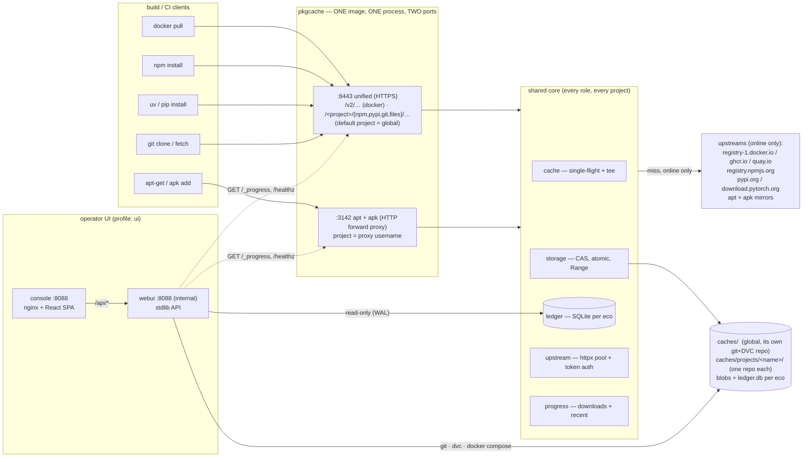
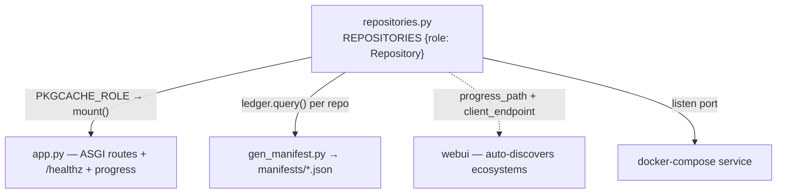
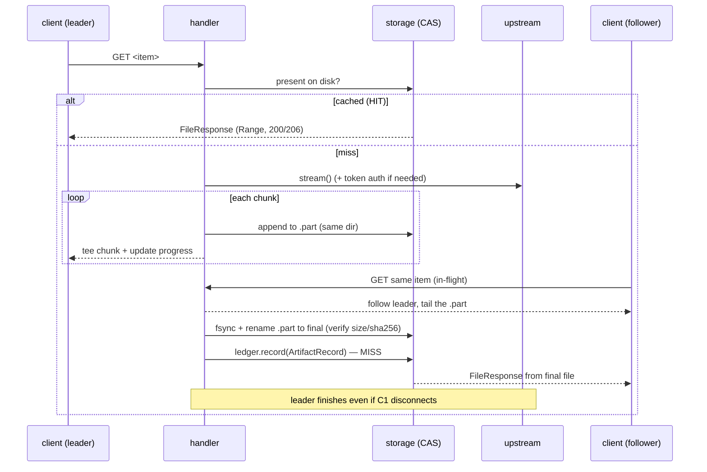
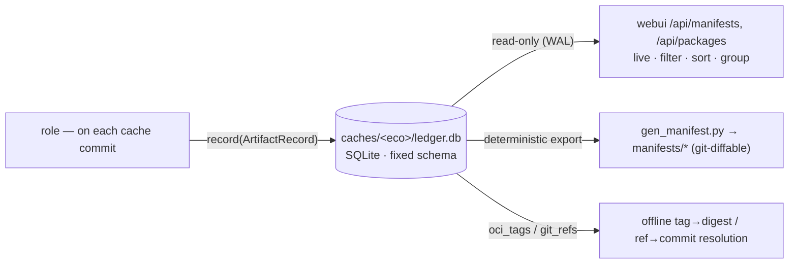
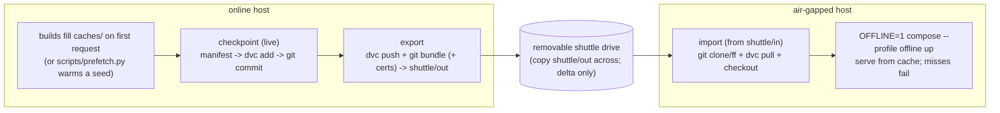
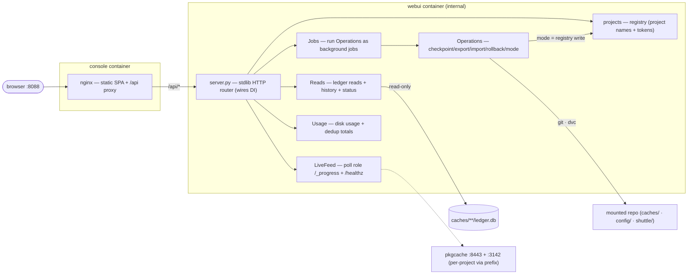

<p align="center">
  
</p>

# package-registry — a versioned, air-gap-portable package cache

> **Current implementation:** use the static Go server in [`go/`](go/) and its
> [beginner setup tutorial](go/internal/web/dist/tutorial.html). The Python,
> Docker Compose, DVC, insecure-TLS, and `--trusted-host` directions later in this
> file describe the retired implementation and must not be used to configure a Go
> deployment.

## Current Go quick start

```bash
cd go
make build
./bin/pkgreg init -data-dir /tmp/pkgreg -hostnames localhost,127.0.0.1
make client-publish DATA_DIR=/tmp/pkgreg
./bin/pkgreg serve -config /tmp/pkgreg/pkgreg.yaml
```

Open `https://localhost:8443/tutorial`, download `pkgreg-client`, and copy the
fingerprint-verified command shown by the page. The default client opens a temporary
child shell and needs no `sudo`; type `exit` to remove its settings. Use
`--persist` only for a managed CI or Docker host that intentionally needs
machine-wide CA and tool configuration.

Current documentation:

- [Go server overview and commands](go/README.md)
- [System overview](docs/system-overview.md)
- [Running and testing](docs/running-and-testing.md)
- [Client design and release status](docs/client-onboarding.md)

---

## Archived Python implementation

Everything below this heading is retained as migration history. It is not current
client or deployment guidance.

A single host runs **one Python service** that serves six package ecosystems at
once — **container images (OCI/Docker), npm, PyPI (pip/uv), apt + apk, git
repositories** (all pull-through-cached), and **generic file artifacts** (a
wget-downloadable, token-gated upload store) — for build/CI machines on a trusted
network. Everything
fetched once is stored under `caches/`, versioned in its **own git + DVC repo**, and
shuttled across an air gap as **deltas only**, with a per-ecosystem **SQLite ledger**
recording exactly what each checkpoint contains.

Everything HTTPS lives on **one port** (`:8443`): docker at `/v2/…`, the rest at
`/<project>/<role>/…` — plus the apt/apk plain-HTTP proxy on `:3142`. The same
instance serves **one or many isolated projects** — each with its own URL prefix,
its own cache tree, and its own git + DVC repo — from a single always-on process,
with no container-per-project sprawl and no per-project ports.

An operator **console** (React + TypeScript) sits on top: browse cache contents,
watch live downloads, see usage **statistics** (per-ecosystem leaderboards, hit
rate, estimated time saved), monitor disk, switch projects, and drive checkpoint /
export / import / rollback and online↔offline switching — all over a dependency-free
standard-library API.

---

## Legacy Python-stack TL;DR

**Run it** (online host — fills the cache on demand; add `--profile ui` for the console on `:8088`):

```bash
./scripts/bootstrap.sh                                 # one-time: .env from host ids + dirs + TLS CA
docker compose --profile online --profile ui up -d     # one process, 6 roles + console
```

Air-gapped host: `OFFLINE=1 docker compose --profile offline --profile ui up -d` (serves from cache only).

**Pull from it** — `HOST` = cache host. The HTTPS roles use a private CA, so each
client is either handed `certs/ca.crt` or told to trust this one host without
verifying. **The recipes below take the second route: no cert file on any client
machine.** apt/apk need neither — they use the plain-HTTP proxy. See
[Trusting the TLS cert](#trusting-the-caches-tls-certificate-fixes-x509-certificate-signed-by-unknown-authority)
for the CA variant and for the one client that needs a host change either way.

```bash
# docker  (dockerhub | ghcr | quay; official images are under library/)
#   Docker has no per-command flag — one of these, once per build host:
#   "insecure-registries": ["HOST:8443"]  in /etc/docker/daemon.json  (+ restart), or
#   sudo cp certs/ca.crt /etc/docker/certs.d/HOST:8443/ca.crt        (no restart)
docker pull HOST:8443/dockerhub/library/python:3.12-slim

# pip     (root/pypi, or root/pytorch-cu124 etc. for PyTorch wheels)
pip install --index-url https://HOST:8443/global/pypi/root/pypi/+simple/ --trusted-host HOST:8443 numpy

# uv
UV_INDEX_URL=https://HOST:8443/global/pypi/root/pypi/+simple/ UV_INSECURE_HOST=HOST:8443 uv pip install numpy

# npm
npm install --registry https://HOST:8443/global/npm/ --strict-ssl=false left-pad

# apt     (forward proxy — keep http mirror lines; no TLS at all)
echo 'Acquire::http::Proxy "http://HOST:3142";' | sudo tee /etc/apt/apt.conf.d/01proxy

# apk     (Alpine — reads http_proxy; switch repos to http)
http_proxy=http://HOST:3142 apk add --no-cache curl

# git     (mirror-and-serve; real upstream host in the path — read-only)
git -c http."https://HOST:8443/".sslVerify=false clone https://HOST:8443/global/git/github.com/pallets/click.git
#   persist once, plus transparent rewriting of hardcoded github.com URLs:
#   git config --global http."https://HOST:8443/".sslVerify false
#   git config --global url."https://HOST:8443/global/git/github.com/".insteadOf "https://github.com/"

# files   (generic artifacts — wget to download; PUT with the write token to upload)
wget --no-check-certificate https://HOST:8443/global/files/builds/v1.2/app.tar.gz
curl -k -T app.tar.gz -H "Authorization: Bearer $TOKEN" https://HOST:8443/global/files/builds/v1.2/app.tar.gz
```

> These flags skip **verification**, not encryption, and are scoped to the cache
> host (except npm's, which is global to npm). That is the same posture as the rest
> of this stack — no-auth console, open apt proxy, isolated network. Note the
> `files` write token rides an `Authorization` header, so on a network where you do
> not trust the path to the host, use the CA variant instead.

For a **named project**, keep the same port and add the project prefix — for
npm/pip/git/files a `/<project>/<role>/…` path segment, for Docker the project is
the first segment of the image name (`HOST:8443/<project>/dockerhub/…`), and for
apt/apk the project is the proxy username (`http://<project>@HOST:3142`). The exact
per-project URLs are shown in the console. Full client recipes:
[Pulling from the cache](#pulling-from-the-cache-per-ecosystem). Versioning + air-gap
transfer: [How to use it](#how-to-use-it).

---

## How to use it

The whole lifecycle is five steps. (Full walkthrough, per-project usage, and TLS
trust are in [Quick start](#quick-start) below.)

**1 — Bring it up on the online host.**

```bash
git init                                            # the code repo (the cache repo self-inits later)
./scripts/bootstrap.sh                              # .env from this host's ids + host-owned dirs + TLS certs (idempotent)
docker compose --profile online --profile ui up -d  # cache (one process, 6 roles) + console on :8088
```

**2 — Point your build/CI tools at it.** The third column is all the TLS setup each
client needs — **no cert file goes on any client machine**; see
[Trusting the TLS cert](#trusting-the-caches-tls-certificate-fixes-x509-certificate-signed-by-unknown-authority)
for the CA variant.

| Tool | Point it at | TLS |
|---|---|---|
| docker | `<host>:8443/{dockerhub,ghcr,quay}/<image>` | `insecure-registries` in `daemon.json`, **or** a CA file — no per-command flag exists |
| pip | `--index-url https://<host>:8443/global/pypi/root/pypi/+simple/` | `--trusted-host <host>:8443` |
| uv | `UV_INDEX_URL=https://<host>:8443/global/pypi/root/pypi/+simple/` | `UV_INSECURE_HOST=<host>:8443` |
| npm | `--registry https://<host>:8443/global/npm/` | `--strict-ssl=false` (global to npm) |
| apt / apk | HTTP proxy `http://<host>:3142/` | none — no TLS involved |
| git | `https://<host>:8443/global/git/<upstream-host>/<owner>/<repo>.git` | `http.<cache-url>.sslVerify false` |
| files | `wget https://<host>:8443/global/files/<path>` · upload `curl -T … -H "Authorization: Bearer <token>"` | `--no-check-certificate` / `curl -k` |

A worked port of an existing Dockerfile using exactly these flags:
[examples/porting/](examples/porting/).

The cache fills automatically on the first request for each package, and the
console at **http://&lt;host&gt;:8088** shows it live (downloads, hit/miss feed, disk).

**3 — Version what you've cached** (live — the proxies keep serving):

```bash
python3 scripts/pkgops.py checkpoint "added numpy 2.1 + torch 2.3"
```

**4 — Ship it across the air gap.** Export stages a delta into `shuttle/out/`; copy
that onto removable media, carry it over, drop it into `shuttle/in/` on the far
side, and import:

```bash
# online host:
python3 scripts/pkgops.py export                    # → shuttle/out/  (then copy onto your media)
# air-gapped host (files copied into shuttle/in/):
python3 scripts/pkgops.py import                    # ← shuttle/in/
OFFLINE=1 docker compose --profile offline --profile ui up -d
```

**5 — Serve offline.** With `OFFLINE=1` every role serves from cache only; a miss
simply fails. Point the air-gapped build hosts at the same URLs.

> Prefer the UI? The console drives checkpoint / export / import / rollback and the
> online↔offline switch with a streaming job log — and creates/switches projects.
> Everything the CLI does, it does too.

A single project can also be taken offline on its own (the console's top-bar
toggle, per selected project): a soft registry flag the cache process applies
within ~5s, serving that one project cache-only while the others keep fetching.
The instance-wide `OFFLINE=1` hard mode always wins while set. See
[docs/multi-project.md](docs/multi-project.md#per-project-offline-soft-mode).

**Accounts & ownership.** Set `UI_ROOT_USER`/`UI_ROOT_PASSWORD` on the webui to turn
on the control-plane auth: a superuser/admin/user model where projects belong to an
admin, only the owner (or a superuser) operates them, and a user sees their admin's
projects. Enforcement is opt-in — until a root superuser is configured the console
API stays open. This gates the *console API* only; the pkgcache pull ports remain
open on a trusted network. See
[docs/multi-project.md](docs/multi-project.md#auth--ownership).

---

## What this is (and what changed)

The proxies used to be **four different upstream projects**, each vendored and
built into its own image:

| Ecosystem | Old component | Language | Now |
|---|---|---|---|
| OCI / Docker | **zot** | Go | `pkgcache` `oci` handler |
| npm | **Verdaccio** | Node | `pkgcache` `npm` handler |
| PyPI / pip | **devpi** | Python | `pkgcache` `pypi` handler |
| apt + apk | **apt-cacher-ng** | C++ | `pkgcache` `apt` handler |
| git repositories | *(new — no prior component)* | — | `pkgcache` `git` handler (mirror-and-serve) |
| generic file artifacts | *(new — no prior component)* | — | `pkgcache` `files` handler (upload + wget) |

Those four protocols' **read / pull-through paths have been ported into one
dependency-light Python codebase** (`pkgcache/`). This intentionally reverses the
project's former "never reimplement a package protocol" stance. The drivers:

- **Drop the Go/Node/C++ polyglot build** — one slim Python image instead of four.
- **One native download-progress implementation** instead of three bolted-on
  patches (devpi never had one — the old UI polled a `/+progress` endpoint that
  didn't exist).
- **Full ownership of the on-disk layout** — a clean content-addressed store and a
  native SQLite ledger written *as packages are cached*, instead of
  reverse-engineering and re-walking each upstream's private cache format.
- **Smaller, air-gap-friendly images.**

For the five pull-through ecosystems only the **read** path is reimplemented (no
publish/push). The **`files`** ecosystem is the deliberate exception — the one write
path — for artifacts that have no upstream to pull from (see
[docs/artifacts.md](docs/artifacts.md)).

Layered on top of that rewrite, the more recent changes are:

- **Cache state split into its own git + DVC repo.** The versioned cache
  (`caches/.git` + `caches/.dvc`) is now **separate from this code repo**, so a
  checkpoint, rollback or shuttle only ever touches cache state — never the
  application code — and the two histories never entangle.
- **Air-gap operations are Python, not bash.** `checkpoint / export / import /
  rollback / mode` live in one backend module (`webui/app/services/operations.py`) as a service that
  yields log lines; the control UI calls it in-process and the operator CLI
  (`scripts/pkgops.py`) is a thin wrapper over the *same* code, so the two can
  never drift.
- **Multi-project support.** One process serves a default **global** project plus
  any number of named projects, each with its own cache tree and repo and reached by
  a URL prefix on the shared ports — created, switched and deleted live from the
  console (see [docs/multi-project.md](docs/multi-project.md)).
- **Live, no-downtime checkpoints.** Atomic writes let DVC hash the cache while the
  proxies keep serving — no quiesce, no stop/start.
- **A git ecosystem** (5th role, `/<project>/git/…` on the unified port). Unlike the byte-cached ecosystems a
  git fetch is a *negotiation*, so the git role is a **mirror-and-serve** smart-HTTP
  server: it keeps a local bare mirror (`git clone --mirror`), revalidates it online
  and serves `git upload-pack` from it offline — read-only, with Git LFS support and
  DVC-safe geometric repack at checkpoint. See [docs/git-cache.md](docs/git-cache.md).
- **A usage statistics tab.** The proxies record each request natively (per-package
  access counts, hit/miss bytes, passive upstream-bandwidth samples), surfaced as a
  **Statistics** console page: per-ecosystem leaderboards, hit rate, bytes served
  from cache, and an estimated **"time saved"** vs. fetching from upstream.
- **A three-page React console** (Overview + Statistics + Packages) with a project switcher.
- **Fixed shuttle staging dirs** (`shuttle/out`, `shuttle/in`) instead of passing a
  drive path — the operator copies `out/` onto media and drops it into `in/` on the
  far side.

> The git history still shows the old layout (`zot/`, `verdaccio/`, `pip/devpi`,
> `apt-cacher-ng/`, retired upstream configs under `config/`); those are the retired
> components kept for reference. The live system is `pkgcache/` + `webui/`.

---

## System architecture


```mermaid
flowchart LR
  subgraph clients["build / CI clients"]
    dk["docker pull"]
    np["npm install"]
    pp["uv / pip install"]
    at["apt-get / apk add"]
    gt["git clone / fetch"]
  end

  subgraph image["pkgcache — ONE image, ONE process, TWO ports"]
    direction TB
    g[":8443 unified (HTTPS)\n/v2/… (docker) · /&lt;project&gt;/{npm,pypi,git,files}/…\n(default project = global)"]
    p[":3142 apt + apk (HTTP forward proxy)\nproject = proxy username"]
  end

  subgraph core["shared core (every role, every project)"]
    cache["cache — single-flight + tee"]
    st["storage — CAS, atomic, Range"]
    led[("ledger — SQLite per eco")]
    up["upstream — httpx pool + token auth"]
    pr["progress — downloads + recent"]
  end

  ups["upstreams (online only):\nregistry-1.docker.io / ghcr.io / quay.io\nregistry.npmjs.org\npypi.org / download.pytorch.org\napt + apk mirrors"]

  subgraph ui["operator UI (profile: ui)"]
    console["console :8088\nnginx + React SPA"]
    webui["webui :8088 (internal)\nstdlib API"]
  end

  dvc[("caches/  (global, its own git+DVC repo)\ncaches/projects/&lt;name&gt;/ (one repo each)\nblobs + ledger.db per eco")]

  dk --> g
  np --> g
  pp --> g
  at --> p
  gt --> g
  g & p --> core
  core -->|"miss, online only"| ups
  st --> dvc
  console -->|"/api/*"| webui
  webui -->|"read-only (WAL)"| led
  webui -.->|"GET /_progress, /healthz"| g & p
  webui -->|"git · dvc · docker compose"| dvc
```

TLS is **terminated in-process** on the unified port from `./certs` (minted by
`gen-certs.sh`) — there is no separate TLS proxy. apt/apk is a plain-HTTP forward
proxy, so it is never TLS (proxy clients like busybox wget can't speak to a TLS
proxy — that's why it keeps its own port). Every project shares the same two ports,
so the one server cert and one Docker `certs.d/<host>:8443` entry cover global and
every project — a new project needs no cert, port, or firewall change. Publish
`443:8443` in compose for port-less docker URLs.

---

## Multi-project on one instance

One central process serves any number of fully isolated projects on the same **two
ports**; **global** is simply the reserved default project, addressed like any
other. Full design notes: [docs/multi-project.md](docs/multi-project.md).

| Aspect | Global project | Named project |
|---|---|---|
| npm / pip / git / files | `:8443/global/<role>/…` | `:8443/<name>/<role>/…` |
| Docker (`:8443`, at `/v2`) | `:8443/dockerhub/<image>` | `:8443/<name>/dockerhub/<image>` (project in the image name) |
| apt / apk (`:3142`) | `http://HOST:3142` proxy | `http://<name>@HOST:3142` (project = proxy username) |
| Cache tree | `caches/<eco>/` | `caches/projects/<name>/<eco>/` |
| Version control | `caches/.git` + `.dvc` | `caches/projects/<name>/.git` + `.dvc` (its own repo) |
| Shuttle | `shuttle/{out,in}/` | `shuttle/{out,in}/projects/<name>/` |
| Registry entry | implicit (never stored) | `config/projects.json` |

- **One process, two ports.** The instance never forks a process or container per
  project, and a new project binds **no new socket** — the unified listener
  (`pkgcache/unified.py`) hands each request to the right role's `RoleServer`
  (`pkgcache/router.py`), which dispatches to the project's sub-app by
  path / image-name / proxy-user. A supervisor in `pkgcache/__main__.py` polls the
  registry and adds/drops project sub-apps live, so creating a project needs no
  restart, rebind, or container recreate.
- **Stable, self-describing URLs.** A project's URL is just its name in the path, so
  it never drifts (nothing to allocate or recompute) and a rewritten `uv.lock` or a
  `FROM` line reads as `…/<name>/…`. Reserved names (`global`, the role names,
  `dockerhub`/`ghcr`/`quay`, `root`, `v2`) can't be taken, so the prefix stays
  unambiguous.
- **Isolation by construction.** Separate cache trees and separate repos mean a
  per-project checkpoint / rollback / shuttle only ever touches that one project.
  There is no cross-project dedup (a deliberate tradeoff for isolation).
- **The registry is shared, JSON, and host-specific.** Both the webui (writer) and
  pkgcache (reader) point at the same `PKGCACHE_PROJECTS` file; it's gitignored
  because it's per-host state.

```json
// config/projects.json — project entries are name-only (no ports to allocate)
{
  "projects": {
    "projA": {},
    "projB": {}
  },
  "tokens": { "projA": "<files write token>" }
}
```

Projects are created / selected / deleted from the console's top-bar switcher (or
`POST/DELETE /api/projects`); every CLI op takes `--project <name>` (default
`global`). A named project's shuttle carries a `project.json` so an import on the
air-gapped side re-registers it and binds its URLs automatically.

---

## Repository layout

```
package-registry/
├── docker-compose.yml         # pkgcache (one process) + webui + console; online/offline/ui profiles
├── .env.example               # host UID/GID + docker gid + shuttle dir → copy to .env (gitignored)
├── pkgcache/                  # THE cache service (one image, six roles, multi-project)
│   ├── Dockerfile  pyproject.toml  pkgcache.yaml  seed.example.yaml  usage.md
│   └── src/pkgcache/
│       ├── app.py             # builds the ASGI app for a (project, role); mounts /healthz + progress
│       ├── unified.py         # UnifiedServer: the ONE HTTPS port; dispatches /v2 + /<project>/<role>
│       ├── router.py          # RoleServer: one per role; routes a request to a project sub-app
│       ├── __main__.py        # uvicorn entrypoint + supervisor that adds/drops project sub-apps live
│       ├── repositories.py    # registry {role: Repository} — the one place ecosystems are listed
│       ├── core/
│       │   ├── repository.py  # the unified Repository contract + ArtifactRecord
│       │   ├── cache.py       # pull-through facade: hit→serve, miss→single-flight stream
│       │   ├── storage.py     # CAS + path-safe layout + atomic temp→fsync→rename + Range serving
│       │   ├── inflight.py    # single-flight leader/follower; tees upstream→disk→client
│       │   ├── upstream.py    # shared httpx pool + anonymous Bearer-token dance
│       │   ├── progress.py    # in-proc progress: in-flight downloads + recent feed (HIT/MISS/FAIL)
│       │   ├── stats.py       # in-proc usage stats (access/hit-miss/bandwidth), flushed to the ledger
│       │   ├── ledger.py      # per-eco SQLite: record() at commit, query()/export() for UI/manifest
│       │   ├── gitmirror.py   # git role: bare-mirror clone/fetch/HEAD-sync/repack + upload-pack streaming
│       │   └── config.py      # per-(project, role) config from env + one YAML + the registry
│       └── handlers/          # one Repository implementation per ecosystem
│           ├── oci.py         # /v2/* — replaces zot
│           ├── npm.py         # packument + tarball — replaces Verdaccio
│           ├── pypi.py        # PEP 503/691 simple index + files — replaces devpi
│           ├── apt.py         # forward proxy, volatile/immutable revalidation — replaces apt-cacher-ng
│           ├── git.py         # mirror-and-serve smart-HTTP + Git LFS (new ecosystem)
│           ├── files.py       # generic artifact store: wget download + token-gated PUT (write path)
│           └── common.py      # shared name/filename normalization
├── webui/                     # operator control plane (standard-library only)
│   ├── server.py              # entry shim → app.main (keeps `python3 webui/server.py`)
│   ├── app/                   # the layered backend package
│   │   ├── main.py            # composition root: build services, inject into the handler, serve
│   │   ├── settings.py        # constants + paths (the one leaf module every layer imports)
│   │   ├── manifest.py        # eco→(subdir,ecosystem) map + ledger→manifest export (shared w/ scripts)
│   │   ├── urls.py            # per-project URL / progress / health / endpoint derivation
│   │   ├── errors.py          # OpError (shared error type)
│   │   ├── api/               # controllers: handler.py (routing/JSON) + files_proxy.py (upload stream)
│   │   ├── services/          # domain model: projects, operations, jobs, livefeed, reads, usage, lockwarm
│   │   └── gateways/          # side-effect boundaries: proc (git/dvc/docker), ledgers (sqlite), pkgcache (HTTP)
│   ├── tests/                 # unit + integration tests (registry, scoped reads/ops, lockwarm)
│   └── console/               # the React + TypeScript SPA (Vite) + nginx Dockerfile
├── scripts/                   # the glue we own
│   ├── pkgops.py              # thin CLI over app.services.operations (the UI imports the SAME code in-process)
│   ├── bootstrap.sh           # one-time host setup: .env (host ids) + dirs + certs (idempotent)
│   ├── gen-certs.sh           # mint the private CA + server cert for in-process HTTPS
│   ├── gen_manifest.py        # export manifests/<eco>.json from the ledgers (+ --rebuild repair)
│   └── prefetch.py            # warm the cache from a declarative seed file
├── config/                    # config/projects.json (the registry) + retired upstream configs
├── caches/                    # cache data — its OWN git+DVC repo (blobs + ledger.db per eco);
│   └── projects/<name>/       #   one git+DVC repo per named project
├── shuttle/                   # fixed air-gap staging: out/ (export) and in/ (import)
├── certs/                     # private CA + server cert/key (gen-certs.sh; gitignored)
└── docs/                      # multi-project.md, docker-builds.md, git-cache.md, artifacts.md
```

---

## Components & design choices

### 1. One image, one process, six roles, TWO ports, many projects

`pkgcache` is a single installable package built into one image. In the default
mode (env unset) **one container runs all six roles in one process on two ports**:
the unified HTTPS port (**8443**, `PKGCACHE_UNIFIED_PORT`) carries docker at `/v2/…`
plus npm/pypi/git/files at the fully qualified `/<project>/<role>/…`, and the
apt/apk forward proxy keeps its own plain-HTTP port (**3142**) because proxy
clients (busybox wget, apt < 1.6) can't speak to a TLS proxy. (A single role can
still be run alone via `PKGCACHE_ROLE` for dev.) The five HTTPS protocols coexist
on one port because their namespaces can't collide: `/v2` is protocol-pinned (and a
reserved project name), and everything else starts with `/<project>/<role>/`. A
`UnifiedServer` (`pkgcache/unified.py`) picks the role; each role's `RoleServer`
(`pkgcache/router.py`) picks the project — by path prefix, image name
(`/v2/<name>/…`), or apt proxy-username — and a supervisor adds/drops project
sub-apps live as the registry changes, no rebind, no recreate.

> **Why:** the cache is identical across ecosystems and projects; only the
> *protocol wrapper* and the *cache root* differ. One image + one process is the
> whole polyglot-build reduction the rewrite was for.

### 2. The unified `Repository` contract

Every ecosystem implements one contract ([core/repository.py](pkgcache/src/pkgcache/core/repository.py)); the
rest of the system (role wiring, manifest export, the webui, checkpoint) depends
only on it, never on a specific ecosystem.


```mermaid
flowchart TD
  reg["repositories.py\nREPOSITORIES {role: Repository}"]
  reg -->|"PKGCACHE_ROLE → mount()"| app["app.py — ASGI routes + /healthz + progress"]
  reg -->|"ledger.query() per repo"| man["gen_manifest.py → manifests/*.json"]
  reg -.->|"progress_path + client_endpoint"| web["webui — auto-discovers ecosystems"]
  reg -->|"listen port"| comp["docker-compose service"]
```

Adding a 5th ecosystem (crates, Go modules, Maven, …) is: add `handlers/<eco>.py`,
register it, add one compose service. Manifest, checkpoint, DVC versioning and the
UI pick it up with no other changes.

### 3. Shared core primitives

Built once, reused by every handler:

- **`storage.py`** — a **content-addressed blob store** (`blobs/sha256/<aa>/<hex>`)
  plus a **path-safe** layout for index files. Every write is an *atomic
  temp-in-same-dir → fsync → rename*, so a checkpoint can hash the cache **live**
  (no proxy quiesce) and DVC never sees a partial file. In-flight `.part` files are
  skipped via `.dvcignore`. Files are world-readable (`0644`/`0755`). Serving goes through
  Starlette `FileResponse`, so **HTTP Range (206 / resume / parallel download) is
  handled for free** on every cached file. Orphan `.part` files are GC'd on startup.
- **`inflight.py`** — a **single-flight** registry keyed per content item. The first
  requester is the *leader* (streams upstream → temp file, **tees** chunks to the
  client, and keeps downloading to completion even if that client disconnects, so
  the cache still warms); concurrent requesters are *followers* that tail-follow the
  growing file and converge on the finished one. One upstream fetch per item, ever.
- **`upstream.py`** — one pooled `httpx.AsyncClient`; bodies are always **streamed**
  (`aiter_bytes`), never buffered, so multi-GB wheels/layers are safe. A generic
  anonymous **Bearer-token dance** (parse `WWW-Authenticate`, fetch + cache the
  token by scope) handles registries that require it.
- **`progress.py`** — the **single** native progress implementation that replaces
  the three old upstream patches. A counting wrapper updates per-download records
  `{id, name, downloaded, total, pct, status}`; a ring buffer records recent pulls
  `{id, name, size, hit, failed, time}`. One JSON shape across all roles.
- **`cache.py`** — the façade handlers call: hit → `FileResponse`; miss →
  single-flight stream with progressive delivery; verifies size/sha256 and records
  the artifact in the ledger on commit; records a **FAIL** in the feed if the fetch
  errors.

#### The one pull-through path (OCI blobs, PyPI files, npm tarballs, apt files)


```mermaid
sequenceDiagram
  participant C1 as client (leader)
  participant H as handler
  participant S as storage (CAS)
  participant U as upstream
  participant C2 as client (follower)

  C1->>H: GET <item>
  H->>S: present on disk?
  alt cached (HIT)
    S-->>C1: FileResponse (Range, 200/206)
  else miss
    H->>U: stream() (+ token auth if needed)
    loop each chunk
      H->>S: append to .part (same dir)
      H-->>C1: tee chunk + update progress
    end
    C2->>H: GET same item (in-flight)
    H-->>C2: follow leader, tail the .part
    H->>S: fsync + rename .part to final (verify size/sha256)
    H->>S: ledger.record(ArtifactRecord) — MISS
    S-->>C2: FileResponse from final file
    Note over H,U: leader finishes even if C1 disconnects
  end
```

### 4. The protocol handlers (ported from the old components)

Each handler is a `Repository` reusing the core primitives. Endpoint shapes,
header semantics, and quirks are ported from the component it replaces.

- **`oci.py` — replaces zot.** Serves `/v2/`, `/v2/<name>/manifests/<ref>`,
  `/v2/<name>/blobs/<digest>`, `/v2/<name>/tags/list`. **Multi-upstream**: the first
  path segment is the destination (`dockerhub → registry-1.docker.io`,
  `ghcr → ghcr.io`, `quay → quay.io`), with Docker Hub's `library/` rule applied.
  Manifests and blobs are content-addressed in **one CAS**; a **tag→digest index**
  (`oci_tags` table) lets the offline side resolve tags with no upstream — collapsing
  zot's two-service online/offline split into one service + an `OFFLINE` flag. As it
  serves, it records each cached **image** in the ledger with a real, **deduplicated**
  size (shared layers counted once) for both tag and by-digest pulls.

  ```mermaid
  flowchart TD
    req["GET /v2/&lt;dest&gt;/&lt;repo&gt;/manifests/&lt;ref&gt;"] --> isDigest{ref is a digest?}
    isDigest -->|yes| cas["serve manifest bytes from CAS by digest"]
    isDigest -->|tag| off{OFFLINE?}
    off -->|online| reval["fetch tag upstream (token dance)\n-> digest; update oci_tags + ledger"]
    off -->|offline| lookup["oci_tags: (upstream,repo,tag) -> digest"]
    reval --> cas
    lookup --> cas
    cas --> client["bytes + Docker-Content-Digest\n(client walks index -> child -> config + layers, all by digest)"]
  ```

- **`pypi.py` — replaces devpi, and fixes its defect.** Serves the PEP 503 / 691
  simple index (`/<index>/+simple/<project>/`), rewriting file URLs back at this
  proxy and **preserving the attributes uv/pip depend on** — per-file hashes,
  `requires-python`, `yanked`, and the PEP 658/714 `core-metadata` marker
  (normalized to the bool-or-`{algo: hash}` map the JSON API requires, so `uv`
  accepts HTML-sourced indexes). `<index>` selects the upstream
  (`root/pypi → pypi.org`, `root/pytorch-cu124 → download.pytorch.org/whl/cu124`, …).
  Files stream through the single-flight core with **full Range support** — fixing
  devpi's defect of re-downloading multi-GB torch wheels on every install.

- **`npm.py` — replaces Verdaccio.** Fetches the packument, **rewrites every
  `dist.tarball`** to point at this proxy, caches the rewritten doc (so offline still
  serves it), and streams/verifies tarballs through the core.

- **`apt.py` — replaces apt-cacher-ng.** A **forward proxy** (apt sets
  `Acquire::http::Proxy`, apk sets `http_proxy`). **Volatile** index files
  (`InRelease`, `Packages*`, `APKINDEX.tar.gz`, …) are revalidated online via stored
  `ETag`/`Last-Modified`; **immutable** files (`*.deb`, `*.apk`, `pool/*`) are served
  from cache without upstream contact. Stays plain HTTP on `:3142`.

- **`git.py` — a new ecosystem, not a port.** A git fetch is a *negotiation* (the
  client posts its have/want set and the server computes a bespoke packfile), so it
  can't be byte-cached by URL like the others. Instead the git role is
  **mirror-and-serve**: it keeps a local **bare mirror** (`caches/git/<host>/<repo>.git`,
  heads + tags, `gc.auto=0`), revalidates it on a short TTL online, and streams
  `git upload-pack` from it — serving the mirror as-is offline. Clients put the real
  upstream host in the path (`https://<cache>:8443/global/git/github.com/<owner>/<repo>.git`) or
  use a one-time `insteadOf` rewrite so submodules, `pip git+https` deps and CPM all
  route through the cache. **Read-only** (push refused); protocol **v0 + v2**, shallow,
  partial, and SHA-pinned fetches all work; a `git_refs` ledger table records ref→commit
  so offline can report what a mirror holds; and **Git LFS** objects reuse the shared
  CAS (they're sha256-addressed). At checkpoint the mirrors get one deliberate
  **geometric repack** so the DVC delta stays proportional to new commits, not the whole
  mirror. Full client + air-gap notes: [docs/git-cache.md](docs/git-cache.md).

- **`files.py` — the write path.** A generic artifact store for things with no
  package protocol: `GET/HEAD` serve files (Range/resume free, HTML directory
  autoindex so `wget -r` and browsers work), `PUT` uploads, `DELETE` removes. Writes
  are **token-gated** (per-project write token, generated in the console;
  `Authorization: Bearer …`), **write-once** (`?overwrite=1` to replace), sha256'd
  inline (optional `X-Checksum-Sha256` verification), and **online-only** (`403`
  under `OFFLINE=1` — the air-gapped side is serve-only). It reuses the shared
  storage atomics/ledger/progress and rides the checkpoint→shuttle flow like any
  other eco. Full recipes: [docs/artifacts.md](docs/artifacts.md).

### 5. The cache ledger (per-ecosystem SQLite)

The manifest is no longer a checkpoint-time JSON re-derived by walking each
proxy's cache. Each role maintains a **SQLite ledger** at `caches/<eco>/ledger.db`
(or `caches/projects/<name>/<eco>/ledger.db`) written *natively as it caches* (one
writer per file, WAL mode). The webui queries it read-only; the git-committed
`manifests/*` is a **derived, deterministic export**.


```mermaid
flowchart LR
  px["role — on each cache commit"] -->|"record(ArtifactRecord)"| db[("caches/&lt;eco&gt;/ledger.db\nSQLite · fixed schema")]
  db -->|"read-only (WAL)"| api["webui /api/manifests, /api/packages\nlive · filter · sort · group"]
  db -->|"deterministic export"| git["gen_manifest.py → manifests/* (git-diffable)"]
  db -->|"oci_tags / git_refs"| offl["offline tag→digest / ref→commit resolution"]
```

The OCI role keeps a tag→digest index (`oci_tags`) and the git role a ref→commit
index (`git_refs`) in the same DB, so the offline side can resolve tags and report
what each mirror holds with no upstream. Usage stats (per-package access counts,
hit/miss byte tallies, upstream-bandwidth samples) live here too, flushed from
memory periodically and read by the console's **Statistics** page.

**Why SQLite:** it's stdlib (the webui stays dependency-free), a single
DVC-trackable file that ships across the gap and rolls back with `dvc checkout`,
and supports real queries for the UI. Rich, volatile fields (`cached_at`, `origin`,
`path`, `arch`, `extra`) live only in the DB; the git export keeps just
`{ecosystem, name, version, digest, size}`, sorted, so diffs stay clean. A
`--rebuild` repair path can repopulate a ledger from disk if it ever drifts.

> The webui reads these ledgers over HTTP, not by opening the files: pkgcache serves
> `GET /+ledger/artifacts` and `/+ledger/stats` per (project, role), and the webui's
> pkgcache gateway fetches + combines them ([webui/app/services/reads.py](webui/app/services/reads.py)).
> So `Ledger.query`/`Ledger.stats` are the single implementation — the stdlib-only
> control plane no longer duplicates the query, and pkgcache owns its schema outright.

### 6. Versioning & air-gap transfer (git + DVC)

The cache is the **data**; git + DVC are the **checkpoint / delta / rollback**
engine. Blobs are content-addressed DVC objects; the small DVC pointers, the
manifest, and the ledger are versioned in git. **Each project's cache state lives
in its own repo, separate from this code repo**, so cache history and code history
never entangle and a rollback can't touch the application.


```mermaid
flowchart LR
  subgraph online["online host"]
    o1["builds fill caches/ on first request\n(or scripts/prefetch.py warms a seed)"]
    o2["checkpoint (live)\nmanifest -> dvc add -> git commit"]
    o3["export\ndvc push + git bundle (+ certs) -> shuttle/out"]
  end
  drive[("removable shuttle drive\n(copy shuttle/out across; delta only)")]
  subgraph air["air-gapped host"]
    a1["import (from shuttle/in)\ngit clone/ff + dvc pull + checkout"]
    a2["OFFLINE=1 compose --profile offline up\nserve from cache; misses fail"]
  end
  o1 --> o2 --> o3 --> drive --> a1 --> a2
```

- **Checkpoint** = a `git checkout`-able snapshot, taken **live** (the proxies keep
  serving): regenerate the manifest, `dvc add` the caches, `git commit` in the
  project's cache repo. Atomic temp→rename writes mean DVC never captures a partial
  blob, so no quiesce/downtime; in-flight `.part` downloads are skipped and land in
  the next checkpoint. (The cache repo's git + DVC store self-initialize on the
  first checkpoint.)
- **Export** stages into the **fixed** `shuttle/out/` (a named project nests under
  `shuttle/out/projects/<name>/`): a `dvc push` of the objects (all of them for a
  full export, or just the `--base..--target` delta), a self-contained `git bundle`,
  and a `checkpoints.json` listing what's inside. The global export also carries the
  TLS material (`ca.crt` + server cert/key — **never** the CA private key); a named
  export carries `project.json` so import can register the project. **The operator
  copies everything in `shuttle/out/` onto removable media** — the tool never takes a
  drive path.
- **Import** reads the **fixed** `shuttle/in/` (where the operator dropped the files
  off their media): clone/fast-forward the bundle, `dvc pull` + `dvc checkout` the
  objects, install certs (global), and re-register a named project from its
  `project.json`. It tolerates the common ways a manual copy mangles the DVC
  `dvcstore/files/md5` layout and normalizes it before pulling.
- **Rollback** = `git checkout <commit> && dvc checkout` inside the project's repo.
- **Offline is an env flag** (`OFFLINE=1`), not a separate service — every role then
  serves from cache only and a miss simply fails (the air-gap contract).

### 7. The operator control plane: stdlib API + React console

Two services in the `ui` profile:


```mermaid
flowchart LR
  browser(["browser :8088"]) --> nginx
  subgraph consoleC["console container"]
    nginx["nginx — static SPA + /api proxy"]
  end
  subgraph webuiC["webui container (internal)"]
    api["server.py — stdlib HTTP router (wires DI)"]
    reads["Reads — ledger reads + history + status"]
    live["LiveFeed — poll role /_progress + /healthz"]
    jobs["Jobs — run Operations as background jobs"]
    ops["Operations — checkpoint/export/import/rollback/mode"]
    usage["Usage — disk usage + dedup totals"]
    proj["projects — registry (project names + tokens)"]
  end
  nginx -->|"/api/*"| api
  api --> reads & live & jobs & usage & proj
  jobs --> ops
  reads -->|"read-only"| ledgers[("caches/**/ledger.db")]
  live -.-> roles["pkgcache :8443 + :3142 (per-project via prefix)"]
  ops -->|"git · dvc"| repo["mounted repo (caches/ · config/ · shuttle/)"]
  ops -->|"mode = registry write"| proj
```

- **webui** ([webui/server.py](webui/server.py)) — a **standard-library-only** HTTP API (no framework,
  no `pip install`; the whole point is to run on a fully air-gapped host). Each
  responsibility is a small **owner class**, wired once by the router via constructor
  injection:
  - **`Reads`** ([reads.py](webui/app/services/reads.py)) — live cache contents from the ledgers, the committed
    manifest, the cache-repo git history, and the cache process's health/mode status
    (an HTTP `/healthz` probe — no docker).
  - **`LiveFeed`** ([live.py](webui/app/services/livefeed.py)) — a background poller (bounded thread pool, project
    list refreshed each cycle) that hits every project's `/_progress` + `/healthz`
    and owns the merged downloads / recent / health snapshots, plus the real **N
    proxies up** / online-offline signal.
  - **`Jobs`** ([jobs.py](webui/app/services/jobs.py)) — a one-at-a-time background runner that drains an
    `Operations` generator into a streamed log the UI polls.
  - **`Operations`** ([ops.py](webui/app/services/operations.py)) — the air-gap **service**:
    checkpoint/export/import/rollback and the online↔offline **mode switch** (a
    registry write the cache process applies live — no container recreate), each a
    generator of log lines, scoped by `project`.
  - **`Usage`** ([usage.py](webui/app/services/usage.py)) — a TTL-cached `du`-style scan with deduplicated-docker
    totals.
  - **`projects`** ([projects.py](webui/app/services/projects.py)) — the registry: the single source of truth for
    what projects exist (names + files write tokens) and where their trees live.

  webui is **internal only** — reached as `webui:8088` on the compose network.
- **console** — retired as a separate service. The operator console is now hand-written
  HTML/CSS/ES-modules compiled into the `pkgreg` binary and served by the Go server at
  `/console`, so there is no React bundle, no Node in the build, and no nginx container
  in front of it. See [go/internal/web/dist/console/](go/internal/web/dist/console/) for
  the source and [docs/system-overview.md](docs/system-overview.md) for what it shows.
  `pkgreg serve --headless` turns it off entirely.

> **Trusted-network deployment** — bootstrap enables control-plane auth by default,
> but the console is plain HTTP on `:8088` and data-plane cache reads are anonymous.
> The console binds to `127.0.0.1` by default. Put it behind TLS and network access
> controls outside an isolated environment; set `UI_BIND=0.0.0.0` only when direct
> LAN access is intentional.
> When TLS terminates at a reverse proxy, set `UI_PUBLIC_ORIGIN` to its exact
> browser-facing origin (for example, `https://packages.example.com`); this also
> makes the session cookie `Secure`.
> The webui runs real `git`/`dvc` commands against the mounted cache-state repos.
> Its application source is immutable in the image, and it has **no
> docker socket and no docker CLI**.

### 8. Scripts (the glue we own)

- **`pkgops.py`** — a thin CLI over the backend `Operations` service: `checkpoint ·
  export · import · rollback · mode`, plus `--project`. It imports `webui/app/services/operations.py` and
  runs the **exact same code** the control UI runs in-process, so the CLI and the UI
  can never drift. Use it by hand on either side of the gap.
- **`gen-certs.sh`** — mint the private CA + server cert for in-process HTTPS.
- **`gen_manifest.py`** — export the ledgers to `manifests/<eco>.json`
  (`PKGCACHE_MANIFEST_ROOT` points it at a project's repo); `--rebuild` repairs a
  ledger from disk.
- **`prefetch.py`** — warm the cache from a declarative seed file by driving real
  client pulls through the local proxies, so the ledger populates exactly as a real
  client would.

---

## Quick start

**Online host:**

```bash
git init                                               # the CODE repo (cache repo self-inits on first checkpoint)
./scripts/bootstrap.sh                                 # .env from this host's ids + host-owned dirs + TLS certs (idempotent)
docker compose --profile online up -d                  # bring up the cache (one process, six roles)
docker compose --profile online --profile ui up -d     # + the operator console on :8088
# no cert files needed on build hosts — each client takes a skip-verify flag (see below)
```

Point build tools at the roles, then version and ship:

```bash
# ... builds run; the cache fills on first request ...
python3 scripts/pkgops.py checkpoint "added numpy 2.1 + torch 2.3"   # version it (live, no downtime)
python3 scripts/pkgops.py export                                     # stage into shuttle/out (full)
# or just the diff between two checkpoints:
python3 scripts/pkgops.py export --base <sha> --target <sha>
# then COPY everything under ./shuttle/out onto your removable media.
```

**Air-gapped host** (carry the drive across, drop the files into `shuttle/in/`):

```bash
python3 scripts/pkgops.py import                       # apply from shuttle/in
OFFLINE=1 docker compose --profile offline --profile ui up -d
```

**Per project**, add `--project <name>` to any op (create the project first from the
console's switcher, or `POST /api/projects`):

```bash
python3 scripts/pkgops.py --project projA checkpoint "added torch"
python3 scripts/pkgops.py --project projA export        # → shuttle/out/projects/projA/
```

### Pull endpoints (global project)

| Ecosystem | Client points at |
|---|---|
| Docker / OCI | `<host>:8443/{dockerhub,ghcr,quay}/<image>` (HTTPS) |
| npm | `https://<host>:8443/global/npm/` |
| pip / uv | `https://<host>:8443/global/pypi/root/pypi/+simple/` (and `root/pytorch-*` indexes) |
| apt / apk | HTTP forward proxy at `http://<host>:3142/` |
| git | `https://<host>:8443/global/git/<upstream-host>/<owner>/<repo>.git` (HTTPS, read-only) |
| files | `https://<host>:8443/global/files/<path>` (HTTPS; wget to download, PUT with the write token) |
| Console UI | `http://<host>:8088` |

A named project serves the same shapes on the **same two ports**, with `global`
swapped for the project name (shown in the console's Endpoints panel — each entry
there also carries copy-paste setup instructions):

| Ecosystem | Named project `<p>` |
|---|---|
| Docker / OCI | `<host>:8443/<p>/{dockerhub,ghcr,quay}/<image>` (project in the image name) |
| npm | `https://<host>:8443/<p>/npm/` |
| pip / uv | `https://<host>:8443/<p>/pypi/root/pypi/+simple/` |
| apt / apk | `http://<p>@<host>:3142/` (project = proxy username) |
| git | `https://<host>:8443/<p>/git/<upstream-host>/<owner>/<repo>.git` |
| files | `https://<host>:8443/<p>/files/<path>` |

The recipes below are written for global; for a project, insert the prefix as
above and use the rest of each recipe verbatim.

### Pulling from the cache (per ecosystem)

`HOST` = the cache host (name or IP). The HTTPS roles use the private CA, so each
client needs either a skip-verify flag (shown inline below — no cert file anywhere)
or `certs/ca.crt` (see
[Trusting the TLS cert](#trusting-the-caches-tls-certificate-fixes-x509-certificate-signed-by-unknown-authority));
apt/apk need nothing — they use the plain-HTTP proxy. For a **named project**, keep
the same port and add the project prefix (path segment, image-name segment, or apt
proxy-username — see the per-project table above; shown in the console's Endpoints
panel).

#### Docker / OCI — unified port 8443, at /v2 (HTTPS)

The first path segment picks the upstream: `dockerhub` → Docker Hub, `ghcr` →
ghcr.io, `quay` → quay.io. Official Docker Hub images live under `library/`.

```bash
# official Docker Hub images are under library/:
docker pull HOST:8443/dockerhub/library/alpine:3.20
docker pull HOST:8443/dockerhub/library/python:3.12-slim
# user/org images keep their namespace:
docker pull HOST:8443/dockerhub/grafana/grafana:11.0.0
# other registries:
docker pull HOST:8443/ghcr/astral-sh/uv:python3.12-bookworm-slim
docker pull HOST:8443/quay/prometheus/prometheus:v2.53.0
```

In a Dockerfile, parameterize the registry so images come through the cache:

```dockerfile
ARG REGISTRY=HOST:8443/dockerhub
FROM ${REGISTRY}/library/python:3.12-slim
```

> **Docker is the one client with no per-command TLS flag**, so it needs a one-time
> host change either way: `"insecure-registries": ["HOST:8443"]` in
> `/etc/docker/daemon.json` (needs a daemon restart), or `certs/ca.crt` under
> `/etc/docker/certs.d/HOST:8443/` (no restart). Projects share this port (the
> project is in the image name), so one entry covers global and every project.

#### pip / uv — unified port 8443, /<project>/pypi (HTTPS)

`<index>` selects the upstream: `root/pypi` → PyPI, `root/pytorch-cu124` →
PyTorch CUDA 12.4 wheels, `root/pytorch-cpu` → CPU wheels, etc.

```bash
# pip (one-off):
pip install --index-url https://HOST:8443/global/pypi/root/pypi/+simple/ --trusted-host HOST:8443 numpy
# PyTorch CUDA wheels (off PyPI):
pip install --index-url https://HOST:8443/global/pypi/root/pytorch-cu124/+simple/ --trusted-host HOST:8443 torch
# uv:
UV_INDEX_URL=https://HOST:8443/global/pypi/root/pypi/+simple/ UV_INSECURE_HOST=HOST:8443 uv pip install numpy
```

Persist it in `~/.config/pip/pip.conf` (`PIP_CERT` covers the cert):

```ini
[global]
index-url = https://HOST:8443/global/pypi/root/pypi/+simple/
trusted-host = HOST:8443           # or: cert = /path/to/ca.crt
```

#### npm — unified port 8443, /<project>/npm (HTTPS)

```bash
npm install --registry https://HOST:8443/global/npm/ --strict-ssl=false <pkg>
# or persist it:
npm config set registry https://HOST:8443/global/npm/
npm config set strict-ssl false              # or, to keep verification: npm config set cafile /path/to/ca.crt
```

#### apt (Debian/Ubuntu) — port 3142 (HTTP forward proxy)

apt is a forward proxy: tell apt to use it and keep **http** mirror lines (it does
not tunnel HTTPS). No CA needed.

```bash
# on a host:
echo 'Acquire::http::Proxy "http://HOST:3142";' | sudo tee /etc/apt/apt.conf.d/01proxy
sudo apt-get update && sudo apt-get install -y curl
```

```dockerfile
# in an image:
RUN echo 'Acquire::http::Proxy "http://HOST:3142";' > /etc/apt/apt.conf.d/01proxy \
 && apt-get update && apt-get install -y curl
```

#### apk (Alpine) — port 3142 (HTTP forward proxy)

apk reads `http_proxy`; switch the repositories to http first. No CA needed.

```dockerfile
RUN sed -i 's/https/http/' /etc/apk/repositories \
 && http_proxy=http://HOST:3142 apk add --no-cache ca-certificates curl
```

#### git — unified port 8443, /<project>/git (HTTPS, read-only)

Put the real upstream host in the path. The cache mirrors the repo server-side on
first request and serves clones/fetches from the mirror (offline too). No CA is
needed if you turn verification off for the cache URL (below); to keep it on, put
`certs/ca.crt` in the system store or point `http.<url>.sslCAInfo` at it.

```bash
# one-off:
git -c http."https://HOST:8443/".sslVerify=false clone https://HOST:8443/global/git/github.com/pallets/click.git
# transparent (once per machine/CI image — covers submodules, pip git+https, CPM, …):
git config --global http."https://HOST:8443/".sslVerify false   # or .sslCAInfo /path/to/ca.crt
git config --global url."https://HOST:8443/global/git/github.com/".insteadOf "https://github.com/"
git config --global url."https://HOST:8443/global/git/gitlab.com/".insteadOf  "https://gitlab.com/"
```

Push is refused (read-only mirror); shallow / partial / SHA-pinned fetches and Git
LFS all work. Details: [docs/git-cache.md](docs/git-cache.md).

> **Online vs offline is transparent to clients.** The recipes are identical on both
> sides of the gap — online fills the cache on first request; with `OFFLINE=1` the
> same URLs serve from cache and a miss simply fails.

### Trusting the cache's TLS certificate (fixes `x509: certificate signed by unknown authority`)

The HTTPS roles terminate TLS in-process with a **private CA** minted by
`gen-certs.sh`. A client that has been told neither to trust `certs/ca.crt` nor to
skip verification rejects the connection:

```
Error response from daemon: failed to resolve reference
"172.17.21.107:8443/projA/dockerhub/pgvector/pgvector:pg17": ... tls: failed to
verify certificate: x509: certificate signed by unknown authority
```

There are two ways to fix it, and you only need one.

#### Route 1 (default) — skip verification for this one host, no cert files

Nothing is copied to any client machine; each tool takes one flag or env var. The
`host:port` is the same one you pull from — the port is shared across projects, so
this is per host:port, never per project.

| Client | Flag | Env / persistent form |
|---|---|---|
| pip | `--trusted-host <host>:8443` | `PIP_TRUSTED_HOST`, or `trusted-host =` in `pip.conf` |
| uv | `--allow-insecure-host <host>:8443` | `UV_INSECURE_HOST` |
| npm | `--strict-ssl=false` | `NPM_CONFIG_STRICT_SSL=false`, or `npm config set strict-ssl false` |
| git | `-c http."https://<host>:8443/".sslVerify=false` | `git config --global http."https://<host>:8443/".sslVerify false` |
| curl / wget | `-k` / `--no-check-certificate` | — |
| apt / apk | *nothing* — the proxy is plain HTTP | — |
| **docker** | *no flag exists* | `"insecure-registries": ["<host>:8443"]` in `/etc/docker/daemon.json`, then restart the daemon |

```bash
pip install --index-url https://172.17.21.107:8443/projA/pypi/root/pypi/+simple/ \
            --trusted-host 172.17.21.107:8443  <pkg>
```

```ini
# ~/.config/pip/pip.conf (pip.ini on Windows)
[global]
index-url = https://172.17.21.107:8443/projA/pypi/root/pypi/+simple/
trusted-host = 172.17.21.107:8443
```

These skip **verification**, not encryption. Every one of them is scoped to the
cache host except npm's, which is global to npm. Two things to keep in mind: the
`files` role's write token rides an `Authorization` header, so use Route 2 if you do
not trust the network path to the host; and **pip before v26 cannot use an
IP-literal HTTPS index at all** (its vendored urllib3 omits SNI for IP addresses and
pip's trust backend refuses the socket with `ValueError: check_hostname requires
server_hostname`) — `--trusted-host` is in fact one of the three ways out of that,
alongside a DNS name in the cert or pip >= 26.

A worked port of a real Dockerfile using this route: [examples/porting/](examples/porting/).

#### Route 2 — distribute `certs/ca.crt` and keep verification on

Copy `certs/ca.crt` to the build host, then trust it. **Docker trusts a registry CA
per `host:port`** — and since every project shares the one unified port (`8443`, with
the project in the image name), a **single** entry covers global and all projects:

```bash
# Docker — one entry for the shared OCI port (no daemon restart needed):
sudo mkdir -p /etc/docker/certs.d/172.17.21.107:8443
sudo cp ca.crt /etc/docker/certs.d/172.17.21.107:8443/ca.crt
```

For everything else, install the CA into the **system trust store** (covers the
Docker daemon too, after a daemon restart; and apt/apk):

```bash
sudo cp ca.crt /usr/local/share/ca-certificates/package-cache.crt   # Debian/Ubuntu
sudo update-ca-certificates
sudo systemctl restart docker        # daemon re-reads system roots on restart
#   RHEL/Alpine: /etc/pki/ca-trust/source/anchors/ + update-ca-trust
```

pip and npm don't use the system store — point them at the CA directly:

```bash
export PIP_CERT=/path/to/ca.crt
npm config set cafile /path/to/ca.crt          # or: export NODE_EXTRA_CA_CERTS=/path/to/ca.crt
export GIT_SSL_CAINFO=/path/to/ca.crt          # git does use the system store; this overrides it
export SSL_CERT_FILE=/path/to/ca.crt           # uv
```

**Name/IP must be in the cert.** A cert is only valid for names in its SANs. If you
reach the cache by an IP or hostname that wasn't covered when the cert was minted,
re-run `./scripts/gen-certs.sh <that-ip-or-host>` (the CA is reused, so existing
trust stays valid) and restart the cache.

#### Removing cert distribution entirely, including for Docker

Routes 1 and 2 both leave Docker needing a one-time host change, because it has no
per-command flag. The only way to get to *zero* client-side setup is a certificate
the clients already trust — your organisation's internal CA if it is already deployed
to machines, or a publicly-trusted cert for a real DNS name (ACME DNS-01 works with
no inbound internet). That moves cert handling from N clients to 1 server. Point
`PKGCACHE_TLS_CERT`/`PKGCACHE_TLS_KEY` at the new pair, or terminate TLS in a proxy
in front — `external_base()` already honours `X-Forwarded-Proto`/`X-Forwarded-Host`
and `X-outside-url`, so rewritten links stay correct. Note that npm/Node uses its own
bundled root store, so an internal CA still needs `NODE_EXTRA_CA_CERTS` there, while
a publicly-trusted cert needs nothing anywhere.

---

## Testing

The control plane ships with tests that don't need docker/dvc:

```bash
cd webui && python3 -m unittest test_projects test_multiproject -v
```

- **`test_projects.py`** — the registry: name-only project creation, shared default
  ports, name validation + reserved names, the `role_prefix` scheme, files write
  tokens, and reading a legacy registry that still carries pool ports.
- **`test_multiproject.py`** — the scoped control plane: per-project prefixed
  endpoints, per-project progress + per-server health derivation, per-project ledger
  reads, per-project git history (must not leak the code repo's history), per-project
  shuttle paths, the `build` dispatcher's project validation, and the DVC `md5/`-tree
  normalization an import performs.

The cache process (pkgcache) has its own suite covering the router — the per-role
selection rules (path prefix, OCI image-name, apt proxy-username), `external_base`
prefixing, and end-to-end ASGI dispatch to the right project's core:

```bash
cd pkgcache && pip install -e '.[test]' && python -m pytest -q
```

---

## Notable behaviors

- **Single worker per role.** Progress and single-flight state are in-process; each
  role runs one uvicorn worker (don't replicate a role).
- **One process, two ports, many projects.** Everything HTTPS on the unified port,
  the apt/apk proxy on its own; projects are routed by URL prefix, and a
  registry-polling supervisor adds/drops project sub-apps live, so creating one
  needs no new port, rebind, or container recreate.
- **No cross-project dedup.** Each project has its own tree and repo — isolation over
  sharing. (A shared DVC remote could be layered later without changing topology.)
- **No garbage collection, by design.** Caches grow unbounded; size is managed by
  DVC/checkpoint hygiene, not eviction. The console's storage monitor surfaces it.
- **Anonymous pulls only.** Public images/packages via the generic token dance; no
  upstream credentials. Docker Hub's anonymous pull cap applies to cold bursts.
- **Open forward proxy (apt).** No mirror allowlist — acceptable only on the
  isolated networks this stack targets (same posture as the no-auth UI).
- **git is mirror-and-serve, read-only.** Local bare mirrors (heads + tags only, so
  commits reachable only from `refs/pull/*` aren't cached), a short revalidation TTL,
  and push refused. Requires a **local filesystem** (repack-while-serving relies on
  POSIX unlink-while-open; not NFS-safe). Git LFS objects are cached in the CAS.
- **`files` is the one write path.** `GET/HEAD` anonymous; `PUT`/`DELETE` need the
  per-project write token (generated in the console, stored in `config/projects.json`,
  verified mtime-cached so rotation applies with no restart) and are **refused when
  `OFFLINE=1`** — uploads happen online, then shuttle across. Write-once by default
  (`?overwrite=1` to replace).
- **Stats accumulate forward.** The Statistics tab's tallies (leaderboards, hit rate,
  time saved) start from when the feature was deployed — historical pulls aren't
  backfilled — and "time saved" is an online-side, bandwidth-based estimate.
- **Fixed shuttle dirs.** Export writes `shuttle/out`, import reads `shuttle/in`
  (relocatable via `PKGCACHE_SHUTTLE`); the operator moves bytes between them across
  the gap. The tool never takes a drive path.
- **One-way serving cutover.** The Python stack can't serve **pre-rewrite**
  checkpoints (old on-disk formats); roll back only to post-rewrite commits, or
  re-warm.
- **Integrity on commit.** Content hashes (and sizes) are verified before the atomic
  rename; non-2xx responses are never cached as content.

---

## Status

A working rewrite, exercised end-to-end through each of the six roles / seven
ecosystem views (including the git mirror-and-serve role with Git LFS and the
generic `files` write path), with multi-project serving, usage statistics, and
air-gap shuttle in place and the control plane unit/integration-tested. Production
base images are digest-pinned and dependency installs use committed lockfiles.
